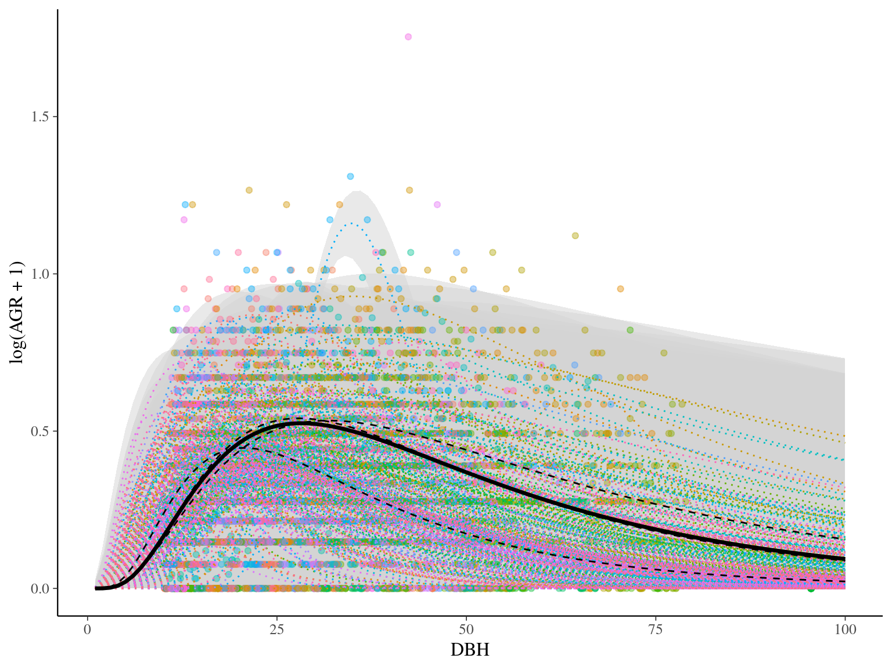
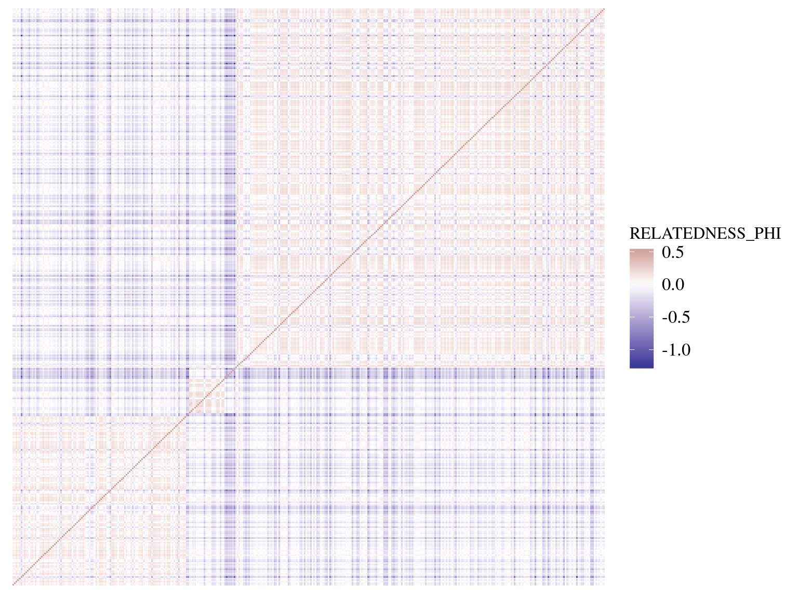

# Introduction

## Setup

```{r setup, message=FALSE, warning=FALSE}
rm(list = ls()) ; gc()
library(knitr)
library(tidyverse)
library(rstan)
library(bayesplot)
theme_set(bayesplot::theme_default())
options(mc.cores = parallel::detectCores())
rstan_options(auto_write = T)
opts_chunk$set(echo = T, eval = T, cache = T, fig.height = 5)
```

## A Phenotype

```{r pheno, echo=F}

```

## A Kinship matrix

```{r kin, echo=F}

```

## Genetic variance

> How much of my phenotype is explained by genetic ?

# Maths

## Animal model

$$y \sim \mathcal N(\mu + u, \sigma_E)$$

$$u \sim \mathcal{MVN}_N(0, \sigma_GK)$$

$$\sigma_P = \sigma_G + \sigma_E$$


* $y$ vector of $N$ individuals phenotypes
* $\sigma_P$ the phenotypic variance
* $\mu$ the mean phenotype
* $K$ matrix of $N\times N$ between-individuals kinship 
* $u$ vector of $N$ random effects of individual kinship 
* $\sigma_G$ phenotypic variance explained by genetic
* $\sigma_E$ residual phenotypic variance unexplained by genetic

## Multivaraite normal distribution

```{r mvn, echo=F}
include_graphics("https://upload.wikimedia.org/wikipedia/commons/8/8e/MultivariateNormal.png")
```

## Multivaraite normal - PDF

$\mathcal{MVN}_N(\mu,\Sigma)$

> If $\Sigma$ is positive-definite, MVN is "non-degenerate"

$$f(x\mid\mu,\Sigma) = \frac{exp(-\frac 12 (x-\mu)^T\Sigma^{-1}(x-\mu))}{\sqrt{(2\pi)^kdet(\Sigma)}}$$

## Multivariate normal - Normal random vector

$$X \sim \mathcal{MVN}(\mu,\Sigma) \iff$$

$$\exists \mu \in \mathbb R^k, A\in\mathbb R^{k\times l}$$

$$\mid X = AZ+\mu ~for~Z_n \sim \mathcal N(0,1), i.i.d$$

$$resulting~in~\Sigma=AA^T$$

## Multivariate normal - Cholesky decomposition

> If $\Sigma$ is positive-definite

> $\Sigma=AA^T$

> And $A$ is the Cholesky decomposition of $\Sigma$

> Cholesky decomposition is implemented in stan !

## Back to the Animal model

$$X \sim \mathcal{MVN}(\mu,\Sigma) \iff X = AZ+\mu\mid Z_n \sim \mathcal N(0,1), i.i.d$$

$$u \sim \mathcal{MVN}_N(0, \sigma_GK) \iff \sigma_GA\tilde u \mid\tilde u \sim\mathcal N(0,1)$$

Resulting in:

$$y \sim \mathcal N(\mu + \sigma_GA\tilde u, \sigma_E)$$

$$\tilde u \sim \mathcal{N}_N(0, 1)$$

$$\sigma_P = \sigma_G + \sigma_E$$

with A the Cholesky decomposition of K

## Back to the linear model

> What about other informations on the individuals ?

$$\mu = \beta_0+\beta_1x_1+..+\beta_qx_q$$

$$\mu = \begin{bmatrix} \beta_0 \\ \beta_1 \\ ... \\ \beta_q  \end{bmatrix} [1,x_1,...,x_q] = \beta X$$

$$y \sim \mathcal N(X \beta + u, \sigma_E)$$

## To go further

> Mathematically the Animal model is the basis of other genomic models including genomic structure throught genetic markers (i.e. SNPs). For instance Linear Mixed Models (LMM), used for major effet detection, or Bayesian Sparse Linear Model (BSLMM), used for polygenic structure inference, are based on the Animal model structure.

## Linear Mixed Models - LMM

$$y \sim \mathcal N(\mu + x\beta + u, \sigma_E)$$

$$u \sim \mathcal{MVN}_N(0, \sigma_GK)$$

$$\sigma_P = \sigma_G + \sigma_E$$

with $x$ one genetic marker and $\beta$ its effect size on the phenotype

## Basyesian Sparse Linear Mixed Models - BSLMM

$$y \sim \mathcal N(\mu + X\tilde \beta + u, \sigma_E)$$

$$u \sim \mathcal{MVN}_N(0, \sigma_bK)$$

$$\tilde \beta \sim \pi\mathcal{N}(0, \sigma_a) + (1-\pi)\delta_0$$

$$\sigma_P = \sigma_a + \sigma_b + \sigma_E$$

with $X$ the matrix of genetic markers and $\tilde \beta$ their sparse effects on the phenotype

# Stan Univariate

## Acknowledgements

> [Diogo Melo](https://github.com/diogro) a Brazilian reasearcher from Sao Paulo who originally developed the stan code after a discussion on the stan forum

## Data 1

* $y$ vector of $N$ individuals phenotypes
* $K$ matrix of $N\times N$ between-individuals kinship

```{stan, output.var="m", eval=F, cache=F}
data {
  int<lower=0>  N ; // # of individuals
  real Y[N] ; // phenotype
  cov_matrix[N] K ; // kinship covariance matrix
}
```

## Data 2

* $y$ vector of $N$ individuals phenotypes
* $K$ matrix of $N\times N$ between-individuals kinship
* $X$ matrix of $N\times J$ covariates

```{stan, output.var="m", eval=F, cache=F}
data {
  int<lower=0>  N ; // # of individuals
  int<lower=0>  J ; // # of covariates + 1 (intercept)  
  real Y[N] ; // phenotype
  matrix[N,J] X ; // covariates
  cov_matrix[N] K ; // kinship covariance matrix
}
```

## Transformed data

* $\sigma_P$ the phenotypic variance
* $u \sim \mathcal{MVN}_N(0, \sigma_GK) \iff \sigma_GA\tilde u \mid\tilde u \sim\mathcal N(0,1)$

```{stan, output.var="m", eval=F, cache=F}
transformed data{
  matrix[N, N] A ; // cholesky-decomposed kinship
  real<lower=0> sigma ; // phenotypic variance
  A = cholesky_decompose(K) ;
  sigma = sd(Y) * sd(Y) ;
}
```

## Parameters 1

$$y \sim \mathcal N(\mu + \sigma_GA\tilde u, \sigma_E)$$

```{stan, output.var="m", eval=F, cache=F}
parameters {
  vector[N]  u_tilde ; // random effects / breeding values
  real mu ; // intercept
  simplex[2] part ; // variance partition
}
```

## Parameters 2

$$y \sim \mathcal N(\beta X + \sigma_GA\tilde u, \sigma_E)$$

```{stan, output.var="m", eval=F, cache=F}
parameters {
  vector[N]  u_tilde ; // random effects / breeding values
  vector[J] beta; // fixed effects
  simplex[2] part ; // variance partition
}
```

## Model 1

$$u \sim \mathcal{MVN}_N(0, \sigma_GK) \iff \sigma_GA\tilde u \mid\tilde u \sim\mathcal N(0,1)$$

$$y \sim \mathcal N(\mu + u, \sigma_E)$$

$$u \sim \mathcal{MVN}_N(0, \sigma_GK)$$

```{stan, output.var="m", eval=F, cache=F}
model {
    vector[N] u ;
    
    u_tilde ~ normal(0, 1) ; // priors
    mu ~ normal(0, 1) ;
    
    u = sqrt(sigma*part[1])*(A * u_tilde) ;

    Y ~ normal(mu + u, sqrt(sigma*part[2]));
}
```

## Model 1 bis

$$y \sim \mathcal N(\mu + \sigma_GA\tilde u, \sigma_E)$$

$$\tilde u \sim \mathcal{N}_N(0, 1)$$

```{stan, output.var="m", eval=F, cache=F}
model {
    u_tilde ~ normal(0, 1) ; // priors
    mu ~ normal(0, 1) ;
    Y ~ normal(mu + sqrt(sigma*part[1])*(A * u_tilde), sqrt(sigma*part[2]));
}
```

## Model 2

$$u \sim \mathcal{MVN}_N(0, \sigma_GK) \iff \sigma_GA\tilde u \mid\tilde u \sim\mathcal N(0,1)$$

$$y \sim \mathcal N(\beta X + u, \sigma_E)$$

$$u \sim \mathcal{MVN}_N(0, \sigma_GK)$$

```{stan, output.var="m", eval=F, cache=F}
model {
    vector[N] u ;
    vector[N] mu;
    
    u_tilde ~ normal(0, 1) ; // priors
    to_vector(beta) ~ normal(0, 1) ;

    u = sqrt(sigma*part[1])*(A * u_tilde) ;
    for(n in 1:N)
       mu[n] = beta * X[n] + a[n] ;

    Y ~ normal(mu, sqrt(sigma*part[2])) ;
}
```

## Model 2 bis

$$y \sim \mathcal N(X\beta + \sigma_GA\tilde u, \sigma_E)$$

$$\tilde u \sim \mathcal{N}_N(0, 1)$$

```{stan, output.var="m", eval=F, cache=F}
model {
    u_tilde ~ normal(0, 1) ; // priors
    beta ~ normal(0, 1) ;
   Y ~ normal(X*beta + sqrt(sigma*part[1])*(A * u_tilde), sqrt(sigma*part[2])) ;
}
```

## Generated quantities

$$\sigma_P = \sigma_G + \sigma_E$$

```{stan, output.var="m", eval=F, cache=F}
generated quantities{
  real sigmaE ; // residual variation
  real sigmaG ; // genetic variation
  sigmaE = sigma*part[2] ;
  sigmaG = sigma*part[1] ;
}
```

## Full

```{stan, output.var="m", eval=F, cache=F}
data {
  int<lower=0>  N ; // # of individuals
  real Y[N] ; // phenotype
  cov_matrix[N] K ; // kinship covariance matrix
}
transformed data{
  matrix[N, N] A ; // cholesky-decomposed kinship
  real<lower=0> sigma ; // phenotypic variance
  A = cholesky_decompose(K) ;
  sigma = sd(Y) * sd(Y) ;
}
parameters {
  vector[N]  u_tilde ; // random effects / breeding values
  real mu ; // intercept
  simplex[2] part ; // variance partition
}
model {
    u_tilde ~ normal(0, 1) ; // priors
    mu ~ normal(0, 1) ;
    Y ~ normal(mu + sqrt(sigma*part[1])*(A * u_tilde), sqrt(sigma*part[2]));
}
generated quantities{
  real sigmaE ; // residual variation
  real sigmaG ; // genetic variation
  sigmaE = sigma*part[2] ;
  sigmaG = sigma*part[1] ;
}
```

# R Univariate 1

## Variances

```{r varsD}
h2 <- 0.25 # heritability
sigmaP <-  1 # phenotypic variance (reduced)
sigmaG <- h2 * sigmaP  # genetic variance
sigmaE <- (1 - h2) * sigmaP # residual variance
```

## Variances

```{r varsG, echo=F}
data.frame(variance = c(sigmaG, sigmaE), component = c("genetic", "residual")) %>% 
  ggplot(aes(1, variance, fill = component)) + geom_col() + 
  theme(axis.title.x = element_blank(), axis.text.x = element_blank(), axis.line.x = element_blank(), axis.ticks.x = element_blank())
```

## Kinship

```{r kinD}
ped <- read.table("https://raw.githubusercontent.com/diogro/QGcourse/master/tutorials/volesPED.txt", header = T)
inv.phylo <- MCMCglmm::inverseA(ped, scale = TRUE)
K <- solve(inv.phylo$Ainv)
K <- (K + t(K))/2
rownames(K) <- rownames(inv.phylo$Ainv)
K[K < 1e-10] = 0  # Not always exactly positive-definite
```

## Kinship

```{r kinG, echo=F}
heatmap(as.matrix(K))
```

## Breeding values

```{r uD}
u <- t(mvtnorm::rmvnorm(1, sigma = sigmaG*as.matrix(K)))
```

## Breeding values

```{r uG, echo=F, message=F}
ggplot(data.frame(u = u), aes(u)) + geom_histogram()
```

## Intercept

```{r interceptD}
mu <- rnorm(1)
mu
```

## Noise

```{r noiseD}
e <- rnorm(nrow(u), sd = sqrt(sigmaE))
```

## Noise

```{r noiseG, echo=F, message=F}
ggplot(data.frame(e = e), aes(e)) + geom_histogram()
```

## Phenotype

```{r phenoD}
y <- mu + u + e
```

## Phenotype

```{r phenoG, echo=F}
ggplot(data.frame(y = y, u = u), aes(u, y)) + geom_point() + geom_smooth(method = "lm")
```

## Inference 1

```{r univariate, eval=F}
AnimalUnivariate1 <- stan_model("Animal_models/AnimalUnivariate1bis.stan") 
fitUnivariate1 <- sampling(AnimalUnivariate1, data = list(N = nrow(y), Y = as.vector(y), K = as.matrix(K)), chains = 2, save_warmup = F)
save(fitUnivariate1, file = "Animal_save/univariate1.Rdata")
```

## Convergence 1

```{r conv, echo=F}
load(file = "Animal_save/univariate1.Rdata")
mcmc_trace(as.array(fitUnivariate1, pars = c("sigmaG", "sigmaE")))
# mcmc_rhat(rhat(fitUnivariate1))
```

## Posteriors 1

```{r post, echo=F}
load(file = "Animal_save/univariate1.Rdata")
mcmc_intervals(as.array(fitUnivariate1, pars = c("sigmaG", "sigmaE")))
```

# R Univariate 2

## Covariates

```{r ageD}
beta <- matrix(c(rnorm(1), rnorm(1)), 2, 1, byrow = TRUE)
rownames(beta) <- c("Intercept", "age")
X <- cbind(rep(1, nrow(u)), rnorm(nrow(u), 5, 3))
```

## Covariates

```{r ageG}
ggplot(data.frame(age = X[,2]), aes(age)) + geom_histogram()
```

## Phenotype 2

```{r pheno2D}
y <- X %*% beta + u + e
```

## Phenotype 2

```{r pheno2G, echo=F}
ggplot(data.frame(y = y, age = X[,2]), aes(age, y)) + geom_point() + geom_smooth(method = "lm")
```

## Inference 2

```{r univariate2, eval=F}
AnimalUnivariate2 <- stan_model("Animal_models/AnimalUnivariate2bis.stan") 
fitUnivariate2 <- sampling(AnimalUnivariate2, data = list(N = nrow(y), J = ncol(X), Y = as.vector(y), X = X, K = as.matrix(K)), chains = 2, save_warmup = F)
save(fitUnivariate2, file = "Animal_save/univariate2.Rdata")
```

## Convergence 2

```{r conv2, echo=F}
load(file = "Animal_save/univariate2.Rdata")
mcmc_trace(as.array(fitUnivariate2, pars = c("beta")))
# mcmc_rhat(rhat(fitUnivariate1))
```

## Posteriors 2

```{r post2, echo=F}
load(file = "Animal_save/univariate2.Rdata")
mcmc_intervals(as.array(fitUnivariate2, pars = c("beta")))
```
