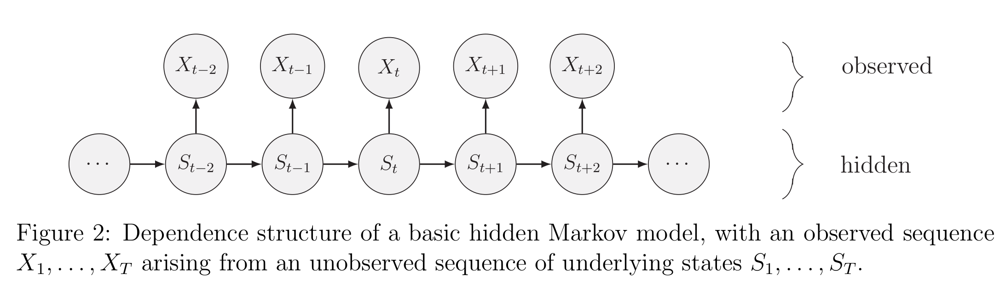
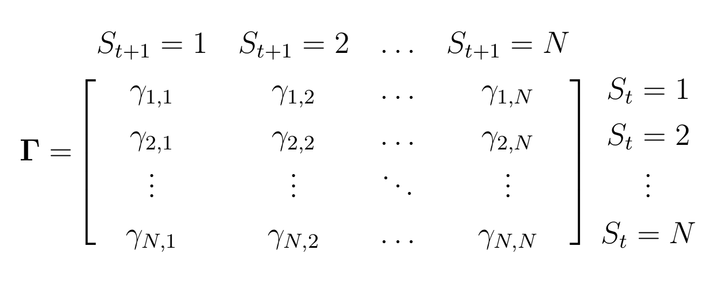
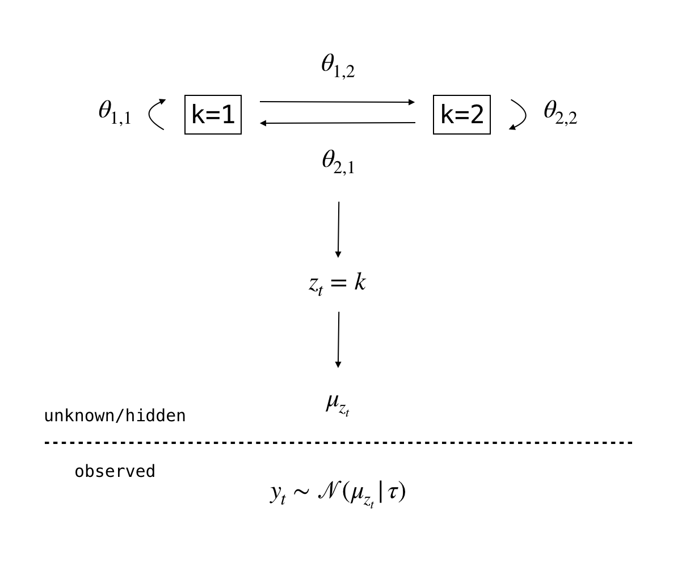
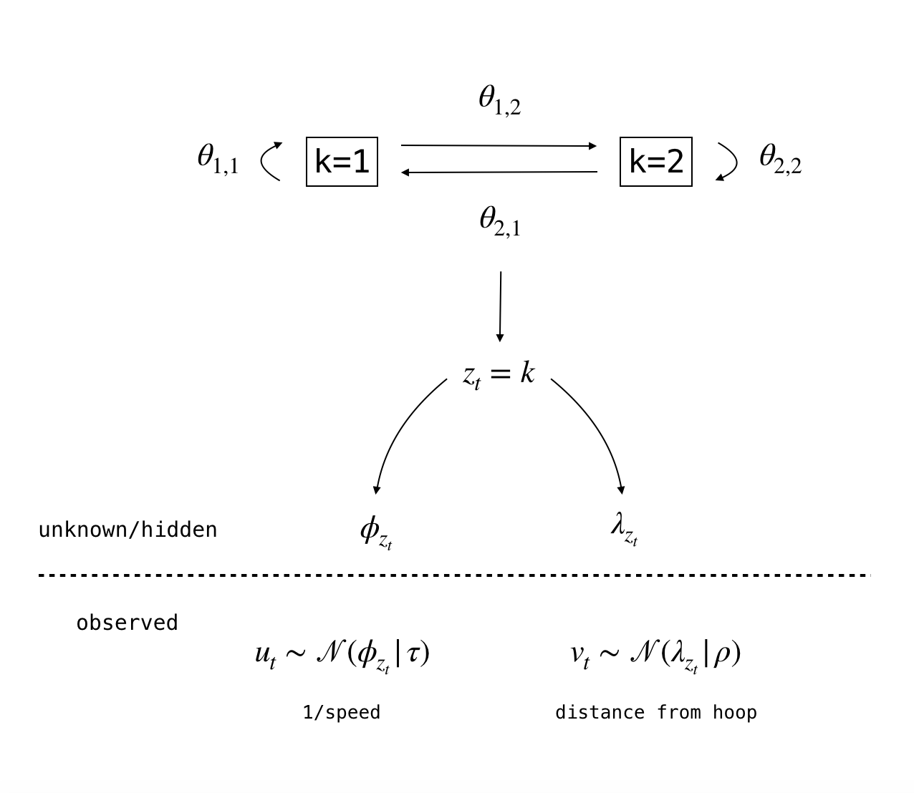

<style>
pre {
  overflow-x: auto;
}
pre code {
  word-wrap: normal;
  white-space: pre;
}
</style>

<style type="text/css">
body{ /* Normal  */
      font-size: 18px;
  }
div.main-container {
  max-width: 2000px;
  margin-left: auto;
  margin-right: auto;
}
</style>


```{css, echo=FALSE,eval=F}
pre {
  max-height: 300px;
  overflow-y: auto;
}

pre[class] {
  max-height: 600px;
}
```

```{r setup, include=FALSE}
library(knitr)
options(width = 300)
knitr::opts_chunk$set(fig.width = 8, fig.height = 5, cache = TRUE)
library(rstan)
rstan_options(auto_write = TRUE)
options(mc.cores = parallel::detectCores())
library(bayesplot)
color_scheme_set("green") # color scheme of the bayesplot package
#library(gridExtra)
#library(grid)
library(ggplot2)
library(tibble)
library(dplyr)
library(tidyr)
```


This document is based on the vignette ["Tagging Basketball Events with HMM in Stan"](https://mc-stan.org/users/documentation/case-studies/bball-hmm.html) and the associated [GitHub repository](https://github.com/imadmali/bball-hmm).

# A reminder on HMMs

## Model formulation from @mcclintock2020uncovering

Hidden Markov models (HMMs) are a class of statistical models for **sequential data**, in most instances related to systems evolving over time.

Figure 2 from @mcclintock2020uncovering:

<div align='center'>
  
</div>


<br>

An HMM is composed of two sequences:

  - an **unobserved state process** (**system process**): $S_{1} , S_{2} , . . . , S_{T}$. A hidden (or latent) variable. Evolves dynamically such that future states depend on the current state.
  
  - an **state-dependent process** (= an **observed process**): $X_{1} , X_{2} , . . . , X_{T}$. The observations can be regarded as noisy measurements of the system states of interest, but they are typically insufficient to precisely determine the state.

<br>


Unlike the larger class of state-space models (see workshop 7), the state process within an HMM  can only take on a **finite** number of possible values: $S_{t} \in \{1, . . . , N \}$ for $t = 1, . . . , T$. The basic HMM formulation further involves **two key dependence assumptions**:
  
  1. The **Markov property**: the probability of a particular state at any time $t$ is completely determined by the state at time $t − 1$.
    
  2. The **conditional independence property**: the probability distribution of an observation at any time $t$ is completely determined by the state active at time $t$. This implies that $X_{t}$ is **conditionally independent of past and future observations, given $S_{t}$**.

<br>

A basic $N$-state HMM can be fully specified by the following three components: 

  - the **initial distribution**: $\mathbf{\delta} = Pr(S_{1} = 1), . . . , Pr(S_{1} = N)$ , specifying the probabilities of being in each state at the start of the sequence.

<!-- In the cases below, we don't estimate the initial distribution. So, how the initial is chosen?  and when is it done?-->

  - the **state transition probabilities**, $\gamma_{ij} = Pr(S_{t+1} = j \, | \, S_{t} = i)$, specifying the probability of switching from state $i$ at time $t$ to state $j$ at time $t + 1$ and usually represented as a $N × N$ state transition probability matrix where $\sum_{j=1}^{N} \gamma_{ij} = 1$.

<div align='center'>
  
</div>

  - the **state-dependent distributions**, $f(x_{t} \, | \, S_{t} = i)$, specifying the probability distribution of an observation $x_{t}$ conditional on the state at time $t$ and usually represented as a $N × N$ diagonal matrix $\text{P}(x_{t}) = diag(f(x_{t} \, | \, S_{t} = 1), . . . , f (x_{t} \, | \, S_{t} = N)$ for computational purposes. Also referred as **emission probabilities** (which govern how likely the outcome was generated by a given state $S_{t}$; see workshop 6), such as: $\text{E}_{ij}=\text{P}(X_{t}=j \, | \, S_{t} = i)$.

<br>

## The HMM example we will work with

From the vignette ["Tagging Basketball Events with HMM in Stan"](https://mc-stan.org/users/documentation/case-studies/bball-hmm.html) and the associated [GitHub repository](https://github.com/imadmali/bball-hmm).

### Model specification

The goal of inference using our HMM:

   - **estimate the parameters** that allow to transition from one state to the next (i.e. transition parameters) and, given the state, the parameters involved in generating the observation (i.e. the emission parameters).

   - **predict** the most likely state sequence based on the observed data and the parameters estimated. => Our HMM is a **generative model**.

<br>

Here our simple example:

We assume there are two states $z_{t} \in [1,2]$. Here is the **generative model**:

$$
\begin{align*}
&y_t \sim \mathcal{N}(\mu_{z_t}, \tau) \\
&z_t \sim \mathcal{Categorical}(\theta_{z_{[t-1]}}) \\
&\mbox{priors on } \mu_k \mbox{ and } \boldsymbol{\theta}\\
\end{align*}
$$


The distribution of each observation $y_t$ is normal with location parameter $\mu_{z_t}$ and a constant scale $\tau$ (which we assume is known). 
  
$\mu_{z_t}$ are **parameters we want to estimate** and are associated with the **emission probabilities** (i.e. **emission parameters**). In our example, $\mu_{z_t} \in [\mu_1,\mu_2]$ (there are two values of $\mu_t$ because $z_t$ can take two values at each time step).

The state variable $z_{t}$ follows the categorical distribution which is parameterized by $\theta_{z_{[t-1]}}$. Since $z_t$ can take two values, $\theta_{z_{[t-1]}}$ also takes two values. $\theta_{z_{[t-1]}}$ corresponds to a row of the **transition matrix** $\boldsymbol{\theta}$ and so sums to 1 (which satisfies the properties of the categorical distribution). Here is the transition matrix $\boldsymbol{\theta}$:

$$
\boldsymbol{\theta} = \begin{pmatrix} \theta_{1,1} & \theta_{1,2}\\ \theta_{2,1} & \theta_{2,2} \end{pmatrix} 
$$

The elements of the transition matrix $\boldsymbol{\theta}$ (i.e. the **transition probabilities**) govern **how likely it is to move from one state to another or to stay within the same state** and are **parameters we want to estimate**. An element of the transition matrix $\boldsymbol{\theta}$ can be considered as the probability of going from the row state to the column state from time $t-1$ to time $t$. So the diagonal elements give the probability of staying in the same state, and the off-diagonal elements give the probability of transitioning from one state to the next. In our example:

* $\theta_{1,1}$: the probability of going from state 1 to state 1.
* $\theta_{2,2}$: the probability of going from state 2 to state 2.
* $\theta_{1,2}$: the probability of going from state 1 to state 2.
* $\theta_{2,1}$: the probability of going from state 2 to state 1.


Here is the graphical representation of the model:

<div align='center'>
  
</div>


### Data simulation

Let's simulate some data!

```{r SimulatingData}
set.seed(7)

# Transition matrix with 2 states
# ===============================
# The rows sums to 1.
theta <- rbind(c(0.8,0.2),c(0.1,0.9))
theta

# The emmission vector with 2 states
# ==================================
mu <- c(3,9)

# Time steps
# ==========
N <- 100


# Hidden states
# =============
z <- 1 # intial state
for (i in 2:N)  z[i] <- sample(1:2, 1, replace = TRUE, prob = theta[z[i-1],]) # At each time step we are in one of the two states.


# Observations
# ============
#  Each of the states corresponds to a location parameter from the normal distribution
# => The observed value is generated depending on which one of two location parameters is selected, which in turn depends on which state you are in.
y <- c()
for (i in 1:N)  y[i] <- rnorm(1, mu[z[i]], 1) # the scale parameter tau is fixed (equals to 1)
```

In the plot below, you can see how state 1 corresponds to smaller values of the outcome while state 2 corresponds to relatively higher values of the outcome.

```{r PlotingSimulatedData, fig.height=10,fig.width=16}
par(mfrow=c(2,1))
plot(z, type="s",
     main = "Hidden States",
     ylab = "State Value",
     xlab = "Time",
     ylim = c(0.5,2.5), yaxt = "n")
axis(2, 1:2, 1:2)
plot(y, type = "l",
     main = "Observed Output",
     ylab = "Observation Value",
     xlab = "Time")
y_plt <- y
y_plt[z==1] <- NA
lines(y_plt, lwd = 3)
legend("bottomright", c("State 1","State 2"), lty = c(1,1), lwd = c(1,3), cex = 0.8)
```


### Model inference


To estimate the parameters, we have to define the **posterior distribution**, and so we have to specify the **likelihood of the data** and the **priors**:

  - The likelihood is defined by the probability of observing that particular sequence of outcome variables (i.e. the observations $y_t$). Using the **forward algorithm** (see workshop 6) we can efficiently calculate the likelihood of the data (to determine the most likely state at each point in time). The forward algorithm is computing the following marginalization efficiently,
  
$$
p(y | \theta, \mu) = \sum_{z} p(y,z | \theta, \mu)
$$

  - We have to define priors for the transition matrix $\boldsymbol{\theta}$ and the emission parameters $\mu_{z_t}$:
      
    * For the emission parameters $\mu_{z_t}$, we use the normal distribution: $\mu_{z_1} \sim \mathcal{N}(3,1)$ and $\mu_{z_2} \sim \mathcal{N}(10,1)$.
        
    * For the transition matrix $\boldsymbol{\theta}$, since each row of the matrix sums to 1, we can use the **Dirichlet distribution on each row of the matrix**: $\boldsymbol{\theta} \sim \text{Dirichlet}(\alpha)$ with $\alpha = \begin{pmatrix} 4 & 2 \\ 2 & 4 \end{pmatrix}$.

<!-- Do we agree that this prior give more confidence to staying in the same time vs moving to another state? -->

Once we estimate the parameters, we can determine the most likely state sequence that generated the sequence of observations. This can be computed with the [Viterbi algorithm](https://en.wikipedia.org/wiki/Viterbi_algorithm). 

More details in @mcclintock2020uncovering!

### Model fitting

Here the Stan code:

$\mu$ is defined as `positive_ordered[K] mu` instead of `real mu[K]` in order to enforce a strict separation between the two $\mu_{z_t}$ values associated with the two states. While in theory weak priors that order the parameters are sufficient to identify the model, in practice Stan needs better parameterization so we enforce an ordering. If we don't do this the sampling algorithm may struggle to find convergence among the parameter chains.

<!-- See Betancourt 2017 for more details. An example of omitting the constraint specification is provided in the github of the vignette -->


```{stan output.var='HMM'}
data {
  int<lower=0> N;               // Number of observations
  int<lower=0> K;               // Number of states
  real y[N];                    // Observations
  matrix<lower=0>[K,K] alpha;   // transit prior (Forgotten in the vignette?)
}

parameters {
  simplex[K] theta[K];    // transition probabilities
  positive_ordered[K] mu; // emission parameters
}

model {
  // priors
  for (k in 1:K) target += dirichlet_lpdf(theta[k] | alpha[k,]');
  target+= normal_lpdf(mu[1] | 3, 1);
  target+= normal_lpdf(mu[2] | 10, 1);
  
  // forward algorithm
  {
  real acc[K];
  real gamma[N, K];
  for (k in 1:K)
    gamma[1, k] = normal_lpdf(y[1] | mu[k], 1);
  for (t in 2:N) {
    for (k in 1:K) {
      for (j in 1:K)
        acc[j] = gamma[t-1, j] + log(theta[j, k]) + normal_lpdf(y[t] | mu[k], 1);
      gamma[t, k] = log_sum_exp(acc);
    }
  }
  target += log_sum_exp(gamma[N]);
  }
}

generated quantities {
  // Viterbi algorithm
  int<lower=1,upper=K> z_star[N];
  real log_p_z_star;
  {
    int back_ptr[N, K];
    real best_logp[N, K];
    for (k in 1:K)
      best_logp[1, k] = normal_lpdf(y[1] | mu[k], 1);
    for (t in 2:N) {
      for (k in 1:K) {
        best_logp[t, k] = negative_infinity();
        for (j in 1:K) {
          real logp;
          logp = best_logp[t-1, j] + log(theta[j, k]) + normal_lpdf(y[t] | mu[k], 1);
          if (logp > best_logp[t, k]) {
            back_ptr[t, k] = j;
            best_logp[t, k] = logp;
          }
        }
      }
    }
    log_p_z_star = max(best_logp[N]);
    for (k in 1:K)
      if (best_logp[N, k] == log_p_z_star)
        z_star[N] = k;
    for (t in 1:(N - 1))
      z_star[N - t] = back_ptr[N - t + 1, z_star[N - t + 1]];
  }
}
```


We fit the model to the data provided above in order to estimate the parameters $\boldsymbol{\theta}$ and $\mu_{z_t}$ along with the hidden state sequence (`z_star`).

```{r results='hide', warning=FALSE}
# Create a data list for Stan:
stan_data <- list(N = length(y),                 # Number of observations
                  K = 2,                         # Number of states
                  y = y,                         # Observations
                  alpha = rbind(c(4,2),c(2,4)))  # For the Dirichlet prior

# Run the model:
hmm_fit <- sampling(HMM, data = stan_data, iter = 1e3, chains = 4)
```

### Post-estimation validation

#### Diagnostics

Here, we check that the chains converged for the parameters we want to estimate: the transition probabilities $\boldsymbol\theta{}$ and the parameters associated with the emission probabilities $\mu$.

We can look at the parameter estimates:

```{r ParameterEstimates}
print(hmm_fit, pars = "z_star", include = FALSE, probs = c(0.05,0.95))
```

And the traceplots:

```{r MCMCtrace, fig.align='center', fig.height=8, fig.width=14}
mcmc_trace(as.array(hmm_fit), regex_pars = "^theta\\[|^mu\\[", facet_args = list(nrow = 2)) + theme_bw()
```

We can see that the parameter estimates well converged because the `Rhat` values are close to 1, there is a high enough effective sample size (`n_eff`; number of independent samples with the same estimation power as the number of autocorrelated samples) and the chains in the traceplots has converged.

#### Posterior predictive checks

We predict 100 output sequences **given the predicted states and emission parameter estimates** and we look if they line up with the observed ouput sequence.

Comment: we could have used the `generated quantities {}` block of our Stan model to make these predictions.

```{r fig.align='center', fig.height=8, fig.width=14}
# extract samples
samples <- as.matrix(hmm_fit)
theta <- samples[,grep("^theta",colnames(samples))]
mu <- samples[,grep("^mu",colnames(samples))]
z_star <- samples[,grep("^z_star",colnames(samples))]

# simulate observations for each iteration in the sample
y_hat <- list()
for (i in 1:nrow(samples)) {
  mu_seq <- sapply(z_star[i,], function(x){mu[i,x]})
  y_hat[[i]] <- rnorm(length(mu_seq), mu_seq, 1)
}

# plot
indxs <- sample(length(y_hat), 100, replace = FALSE)
plot(y, type = "n",
     main = "Observed vs Predicted Output",
     ylab = "Observation Value",
     xlab = "Time",
     ylim = c(0,11))
for (i in indxs) {
  lines(y_hat[[i]], col = "#ff668890")
}
lines(y, lwd = 2)
legend("bottomleft", c("Observed","Predicted"), col = c("#000000","#ff668890"), lty = c(1,1), lwd = c(2,1), cex = 1)

```

Our posterior predictions line up nicely with the observed output sequence. This is one indication that the data generation process was appropriately modeled.
 
 
Below, since we know the true state values (we simulated the data), we can check that the predicted state values line up the true state values.


```{r fig.align='center', fig.height=8, fig.width=14}
par(mfrow=c(2,1))

# Latent states
# =============
plot(z, type="s",
     main = "Latent States",
     ylab = "State Value",
     xlab = "Time",
     ylim = c(0.5,2.5), yaxt = "n")
axis(2, 1:2, 1:2)
points(colMeans(z_star), cex = 0.5)
legend("topright", c("Actual","Predicted"), pch = c(NA,1), lty = c(1,NA), cex = 0.9)

# Observations
# ============
plot(y, type = "l",
     main = "Observed Output",
     ylab = "Observation Value",
     xlab = "Time")
y_plt <- y
y_plt[z==1] <- NA
lines(y_plt, lwd = 3)
legend("topright", c("State 1","State 2"), lty = c(1,1), lwd = c(1,3), cex = 1)
```


Our predictions line up nicely with the true values.

# Tagging Drive Events with HMMs


In basktball, a [drive](https://www.youtube.com/watch?v=SAp95x3iCCY) occurs when an offensive player dribbles the ball towards the hoop for a shot attempt (often a layup). We can translate a drive into **two types of events that are happening simultaneously** over time until the shot attempt,

* The player increases their speed.
* The player reduces the distance between himself and the hoop.

See the video in the [vignette](https://mc-stan.org/users/documentation/case-studies/bball-hmm.html) that illustrates what a drive event looks like in the player tracking data.


### Pre-process Data

In this [script](https://github.com/imadmali/bball-hmm/blob/master/data/pt_data_evt140_drive.R), they use the player tracking data to construct the speed and distance metrics associated with the drive event. They define speed as distance over time and use Euclidean distance to determine the player's distance from the hoop at each time step. 

We can directly download the pre-processed data from [the github](https://github.com/imadmali/bball-hmm/tree/master/data):

```{r DriveData, fig.align='center', fig.height=8, fig.width=14}
drive <- readRDS("data/evt140_0021500411.RDS")

lavine_speed <- drive$game$lavine_speed
lavine_dist <- drive$game$lavine_dist

par(mfrow = c(2,1))
plot(lavine_dist, type = "l",
     main = "Distance from Hoop",
     xlab = "Time (25hz)", ylab = "Distance from Hoop")
plot(lavine_speed, type = "l",
     main = "Raw Speed",
     xlab = "Time (25hz)", ylab = "Speed")
```

As the speed metric is pretty noisy, we use a basic rolling mean with a window of three time steps to smooth the data. Actually, in our example the data is not so noisy that it would affect the performance of our model so the smoothing is mostly for aesthetics and ease of interpretation. 

```{r SmoothingSpeed, fig.align='center', fig.height=4, fig.width=14}
# Removing the first value which is NA
na_indx <- which(is.na(lavine_speed))

lavine_speed <- lavine_speed[-na_indx]
lavine_dist <- lavine_dist[-na_indx]

# Smoothing the speed
lavine_speed_smooth <- rep(lavine_speed[2],2)
for (i in 3:length(lavine_speed))
  lavine_speed_smooth[i] <- mean(lavine_speed[(i-2):i], na.rm=TRUE)

plot(lavine_speed_smooth, type = "l",
     main = "Smooth Speed",
     xlab = "Time (25hz)", ylab = "Speed")
```


### Specifying and fitting the Model

In this model, we want to **infer two hidden states:** drive and none (i.e. the offensive player is driving vs not driving), using both the speed and distance observed sequences.

In order to get the speed and distance sequences to trend in the same direction during a drive, we use 1/speed, so that:

* The player reduces his 1/speed (equivalent to increasing speed).
* The player reduces the distance between himself and the basket.

<br>

Discussion about whether to use the exponential or normal distribution for modeling the emission probabilities:

Using the exponential distribution function to model the emission probabilities poses two issues:

  1. **Scale of the data**: Both the distance and the speed metric are on very different scales. It would make sense to take the log of these data to normalize them but unfortunately this is infeasible since the support of the exponential distribution must be greater than or equal to 0.

<!-- To discuss with Fred -->
  
2. **Computationally unstable**: The 1/speed transformation contains values that are mostly close to 0. This makes it difficult to use distributions that have most of their density around 0, such as the exponential distribution. The reason being that it will be difficult to discriminate between the "drive" and "none" states, since modeling 1/speed with the exponential distribution will attribute high probabilities to both states.

While it is mathematically more tractable to use the exponential distribution, we argue that such a choice to model the data generation process will be computationally unstable. Instead, we opt to use the normal distribution on both the 1/speed and distance metrics, enabling us to model the data on the log scale. 

In the [vignette](https://mc-stan.org/users/documentation/case-studies/bball-hmm.html), they also implemented the exponential distribution version of the modeland they we found that the parameter chains struggled to converge in some model runs, validating the approach of using the normal distribution to model the log-transformed data.

<br>

Here is our HMM:


$$
\begin{align*}
u_t &\sim \mathcal{N}(\phi_{z_t}, \tau) \\
v_t &\sim \mathcal{N}(\lambda_{z_t}, \rho) \\
z_t &\sim \mathcal{Categorical}(\theta_{z_{[t-1]}}) \\
\theta_{z_t} &\sim \mathcal{Dir}(\alpha_{z_t}) \\
\end{align*}
$$

where $z_t \in [1,2]$, $\tau=\rho=0.1$, and $\alpha = [[4,2],[2,4]]$. <!-- The alpha prior gives more weight to staying in the same state vs switching to another state, right? -->

Graphical representation of the process we are trying to model:

<div align='center'>
  
</div>

We create the data list for Stan:

```{r FormatDataDrive}
stan_data <- list(N = length(lavine_speed_smooth),
                  K = 2,
                  u = log(1/lavine_speed_smooth),
                  v = log(lavine_dist),
                  alpha = rbind(c(4,2),c(2,4)),
                  tau = 0.1,
                  rho = 0.1)
```

We fit the model to Lavine's data for a single drive possession.

```{stan output.var="drive"}
// drive model (normal dist)
data {
  int<lower=1> K;               // number of states (1 = none, 2 = drive)
  int<lower=1> N;               // length of process
  real u[N];                    // 1/speed
  real v[N];                    // hoop distance
  matrix<lower=0>[K,K] alpha;   // transit prior
  real<lower=0> tau;            // sd u
  real<lower=0> rho;            // sd v
}
parameters {
  simplex[K] theta[K];          // transit probs
  // enforce an ordering: phi[1] <= phi[2] 
  ordered[K] phi;      // emission parameter for 1/speed
  ordered[K] lambda;   // emission parameter for hoop dist
}
model {
  // priors
  for (k in 1:K)
    target += dirichlet_lpdf(theta[k] | alpha[k,]');
  target+= normal_lpdf(phi[1] | 0, 1);
  target+= normal_lpdf(phi[2] | 3, 1);
  target+= normal_lpdf(lambda[1] | 0, 1);
  target+= normal_lpdf(lambda[2] | 3, 1);
  // forward algorithm
  {
    real acc[K];
    real gamma[N,K];
    for (k in 1:K)
      gamma[1,k] = normal_lpdf(u[1] | phi[k], tau) + normal_lpdf(v[1] | lambda[k], rho);
    for (t in 2:N) {
      for (k in 1:K) {
        for (j in 1:K)
          acc[j] = gamma[t-1,j] + log(theta[j,k]) + normal_lpdf(u[t] | phi[k], tau) + normal_lpdf(v[t] | lambda[k], rho);
        gamma[t,k] = log_sum_exp(acc);
      }
    }
    target+= log_sum_exp(gamma[N]);
  }
}

generated quantities {
  int<lower=1,upper=K> z_star[N];
  real log_p_z_star;
  // Viterbi algorithm
  {
    int back_ptr[N,K];
    real best_logp[N,K];
    for (k in 1:K)
      best_logp[1,K] = normal_lpdf(u[1] | phi[k], tau) + normal_lpdf(v[1] | lambda[k], rho);
    for (t in 2:N) {
      for (k in 1:K) {
        best_logp[t,k] = negative_infinity();
        for (j in 1:K) {
          real logp;
          logp = best_logp[t-1,j] + log(theta[j,k]) + normal_lpdf(u[t] | phi[k], tau) + normal_lpdf(v[t] | lambda[k], rho);
          if (logp > best_logp[t,k]) {
            back_ptr[t,k] = j;
            best_logp[t,k] = logp;
          }
        }
      }
    }
    log_p_z_star = max(best_logp[N]);
    for (k in 1:K)
      if (best_logp[N,k] == log_p_z_star)
        z_star[N] = k;
    for (t in 1:(N - 1))
      z_star[N - t] = back_ptr[N - t + 1, z_star[N - t + 1]];
  }
}

```

```{r FitModelDrive}
fit <- sampling(drive, data = stan_data, chains = 4, iter = 1e3)
```

### Post-estimation validation

#### Diagnostics

```{r ParameterEstimatesDrive}
print(fit, pars = 'z_star', include = FALSE, probs = c(0.05,0.95))
```

```{r TraceplotDrive, fig.align='center', fig.height=8, fig.width=14}
mcmc_trace(as.array(fit), regex_pars = "^theta|^phi|^lambda") + theme_bw()
```


#### Posterior predictive checks

We want to check that our posterior predictions overlap with the observed states and the original distance/speed values. For that, we have to post-process the predicted states:

  1. We extract the  samples of the estimated parameters $\lambda$, $\phi$ and the predicted hidden state sequence `z_star`.
  
```{r ExtractSamplesDrive}
samples <- as.matrix(fit)                               # 2000 samples of 426 parameters
phi <- samples[,grep("^phi", colnames(samples))]        # 2000 samples of 2 parameters phi_1 and phi_2
lambda <- samples[,grep("^lambda", colnames(samples))]  # 2000 samples of 2 paramters lambda_1 and lambda_2
z_star <- samples[,grep("^z_star", colnames(samples))]  # 2000 samples of 416 parameters (the hidden state sequence)
```

  2. We use the extracted samples to **predict 100 output sequences given the predicted states $z_t$ and the estimates of the emission parameters $\lambda_{z_{t}}$ and $\phi_{z_{t}}$ **.

```{r GenerateOutputSequenceDrive}
phi_hat <- list()
lambda_hat <- list()
for (i in 1:nrow(samples)) {
  
  # we attribute the phi value corresponding to the predicted state (z_1 => phi_1; z_2 => phi_2)
  phi_seq <- sapply(z_star[i,], function(x){phi[i,x]}) 
  
  # we attribute the lambda value corresponding to the predicted state (z_1 => lambda_1; z_2 => lambda_2)
  lambda_seq <- sapply(z_star[i,], function(x){lambda[i,x]})
  
  # we use the predictive model to generate the posterior predictions of the estimated distance and speed given the predicted states 
  phi_hat[[i]] <- rnorm(length(phi_seq), phi_seq, 0.1) # tau = 0.1
  lambda_hat[[i]] <- rnorm(length(lambda_seq), lambda_seq, 0.1) # rho = 0.1
}

indxs <- sample(length(samples), 100, replace = FALSE)
```
  
  3. In the first two graphs, we overlay the predicted values of the distance and speed given the predicted states with the true observations. In the third graph, we plot the predicted state values.
  
```{r PlotPostPredictiveChecksDrive, fig.align='center', fig.height=12, fig.width=14}
par(mfrow = c(3,1))

# Distance from the hoop
plot(stan_data$v, type = "n",
     main = "Distance from Hoop (log scale)",
     xlab = "Time (25hz)", ylab = "log(distance)",
     cex.lab=1.5,cex.main=1.8)
for (i in 1:length(indxs))
  lines(lambda_hat[[i]], col = "#ff668890")
lines(stan_data$v, lwd = 2)
legend("bottomleft", c("Observed","Predicted"), col = c("#000000","#ff668890"), lty = c(1,1), lwd = c(2,1), cex = 1.3)

# Speed
plot(stan_data$u, type = "n",
     main = "Smooth Speed (log scale)",
     xlab = "Time (25hz)", ylab = "log(1/speed)",
      cex.lab=1.5,cex.main=1.8)
for (i in 1:length(indxs))
  lines(phi_hat[[i]], col = "#ff668890")
lines(stan_data$u, lwd = 2)
legend("topleft", c("Observed","Predicted"), col = c("#000000","#ff668890"), lty = c(1,1), lwd = c(2,1), cex = 1.3)

# Hidden states
plot(round(colMeans(z_star)), type = "l", pch = 1, cex = 0.5,
     main = "Hidden States",
     ylab = "State", xlab = "Time (25hz)",
     ylim = c(0.5, 2.5), yaxt = "n",
     cex.lab=1.5,cex.main=1.8)
axis(2, c(1,2), c("Drive", "None"), las = 2,cex.axis=1.5)
```

The posterior predictions do not perfectly track the variation in the original variables (the distance and speed variables), but the predicted states do overlap very well with the observed states (see video in the [vignette](https://mc-stan.org/users/documentation/case-studies/bball-hmm.html)).


# Defensive Assignment

We will now determine the assignment of defenders to offensive players in basketball using HMMs.

What is a good defensive positioning? The defender has to be **somewhere in the triangle defined by the location of the hoop, the ball, and the offensive player in question** (man-to-man defense). Here an illustrated example of a good defense position:

```{r DefensivePositioningIllustration, fig.align='center', fig.width=6, fig.height=6}
h <- c(0,-1)
b <- c(0,1.5)
o <- c(-1,0.5)
d <- c(-0.3,0.3)
plot(rbind(h,b,o,h), type = "o",
     xlim = c(-2,1), ylim = c(-2,2),
     xlab = "", ylab = "", xaxt = "n", yaxt = "n",
     pch = 20)
points(d[1],d[2], pch = 20)
text(h[1],h[2], "hoop", pos = 1, cex = 0.8)
text(b[1],b[2], "ball", pos = 3, cex = 0.8)
text(o[1],o[2], "offensive player", pos = 2, cex = 0.8)
text(d[1],d[2], "defender", pos = 3, cex = 0.8)
```


## Model specification

We model the **defender's position** $d_{t}$ at time step $t$ as 2 draws (the defensive player's coordinates) from the normal distribution where the location parameter is defined as a **convex combination of the hoop, ball, and offensive player coordinates**.

$$
d_{t} \sim \mathcal{N}(\mu_{z_{t}}, \tau) \\
\mu_{z_t} = o_{z_t}\lambda_{1} + h\lambda_{3} + b_t\lambda_{2} \\
$$

The index $z_t \in [1,2,\ldots,5]$ represents the **hidden states** (one of the 5 offensive player = player that is being guarded by the defensive player at time step $t$). $o_{z_t}$ is the position of the offensive player associated with state $z_t$, $h$ is the position of the hoop, and $b_t$ is the position of the ball. 

As $\mu_{k}$ is a convex combination of the hoop, ball, and offensive player coordinates, this implies that $\lambda$ is a simplex (the sum of all the elements equals 1):

$$
\lambda_{1} + \lambda_{2} + \lambda_{3} = 1 \\
\Leftrightarrow \\
\sum_l{\lambda_l} = 1
$$

Here is our HMM, **which determine, for a single defender, which one of the five offensive players is being guarded at each time step**:

$$
d_{t} \sim \mathcal{N}(\mu_{z_{t}}, \tau) \\
\mu_{z_t} = o_{z_t}\lambda_{1} + h\lambda_{3} + b_t\lambda_{2} \\
z_{t} \sim \mbox{Categorical}(\theta_{z_{t-1}}) \\
\mbox{s.t. } \sum_l{\lambda_l} = 1 \\
\mbox{priors on } \lambda, \theta
$$

A good choice for priors on $\lambda$ and each row of the transition matrix $\theta$ would be the Dirichlet distribution.


## Data simulation

Before applying the model directly to the player tracking data, we check if our model performs appropriately with simulated data.

For 20 time steps, we sample a fixed position of five offensive players (`o1` to `o5`) and the ball (`b`). We do this with trivial noise to mimic the noisiness of the player tracking data. We construct the hoop coordinate without noise since the position is fixed over time. With all these pieces in place we trace the path of a single defender in an upside-down parabola shape around the hoop.

```{r SimDataListDefense, fig.align='center', fig.width=8, fig.height=8}
set.seed(7)

N <- 20 # Number of time steps (corresponding to defender's positions)
tau <- 0.01 # scale parameter associated with convex combination
h <- c(0,-1) # coordinates of the hoop (without noise)
K <- 5 # Number of states = offensive players

# Sample positions
b <- cbind(rnorm(N, 0, tau),
           rnorm(N, 1.5, tau)) # Coordinates of the ball (in an almost fixed location, just with very small noise)
o1 <- cbind(rnorm(N, -1, tau),
            rnorm(N, 0.5, tau)) # Coordinates of the first offensive player  (same, with very small noise)
o2 <- cbind(rnorm(N, 1, tau),
            rnorm(N, 0.5, tau))
o3 <- cbind(rnorm(N, 0.5, tau),
            rnorm(N, 1, tau))
o4 <- cbind(rnorm(N, -0.1, tau),
            rnorm(N, 1.5, tau))
o5 <- cbind(rnorm(N, -0.5, tau),
            rnorm(N, -0.7, tau))
d <- cbind(seq(-1,1,length.out=N),
           -0.6*seq(-1.5,1.5,length.out=N)^2+0.5) # Coordinates of the defensive player (upside-down parabola shape around the hoop)

# convert offensive positions into an array of shape (K,N,2)
o <- array(c(o1,o2,o3,o4,o5), dim = c(N,2,K))
o <- aperm(o, c(3,1,2))

# store as list
defense_example <- list(N = N,
            K = K,
            tau = tau,
            h = h,
            b = b,
            o = o,
            d = d)

# Plot this overly simplied basketball possession:
source("Workshop10_HMMandBasketball/plt_defense_example.R")
plt_defense_example(defense_example, main = "Defense Example")
points(d[,1], d[,2], col = "#ff6688", pch = 0)
```

In our example, since the ball and hoop locations do not change over time, the convex combination only varies based the offensive player under consideration. We want the model to assign a particular offensive player to the defender if the defender location is the closest to the convex combination generated by that offensive player. For that, we want to estimate the appropriate convex combination.

### Fixed convex combination

First, we fit the model to the simulated data assuming that the convex combination parameters are known and fixed to $\lambda = [1/3,1/3,1/3]$. This approach strongly biases the model to prior knowledge about where defenders are situated when guarding offensive players. Specifically it states that the locations (offensive player, hoop, and ball) are equally weighted so that the convex combination (i.e. optimal defensive player positioning) is not skewed towards certain locations. For example if we specified $\lambda = [0.4,0.4,0.2]$ then the convex combination will be closer to the offensive player and the hoop, and farther away from the ball. In this situation, a defender who is closer to this convex combination will be assigned to the offensive player over a defender who is closer to the convex combination defined by $\boldsymbol{\lambda} = [1/3,1/3,1/3]$.

```{r SimDataListDefenseAddLambda}
lambda <- c(1/3,1/3,1/3)  # fixing convex combination parameter
defense_example$lambda <- lambda
```


```{stan output.var="SimDefenseFixedLambda"}
data {
  int<lower=0> N;    // Number of time steps
  int<lower=0> K;    // Number of states
  real<lower=0> tau; // scale parameter associated with convex combination
  real lambda[3];    // fixed convex combination of parameters
  vector[2] h;       // location of the hoop
  vector[2] b[N];    // location of the ball (array of size N containing vectors of size 2)
  vector[2] d[N];    // location of the defensive players (array of size N containing vectors of size 2)
  vector[2] o[K,N];  // location of the offensive players (array of size K,N containing vectors of size 2)
}

parameters {
  simplex[K] theta[K]; // transition matrix we want to estimate
}

model {
  // forward algorithm
  {
  real acc[K];
  real gamma[N, K];
  for (k in 1:K)
    gamma[1, k] = normal_lpdf(d[1] |  o[k,1]*lambda[1] + h*lambda[2] + b[1]*lambda[3], tau);
  for (t in 2:N) {
    for (k in 1:K) {
      for (j in 1:K)
        acc[j] = gamma[t-1, j] + log(theta[j, k])
          + normal_lpdf(d[t] |  o[k,t]*lambda[1] + h*lambda[2] + b[t]*lambda[3], tau);
      gamma[t, k] = log_sum_exp(acc);
    }
  }
  target += log_sum_exp(gamma[N]);
  }
}

generated quantities {
  int<lower=1,upper=K> z_star[N];
  real log_p_z_star;
  {
    int back_ptr[N, K];
    real best_logp[N, K];
    for (k in 1:K)
      best_logp[1, k] = normal_lpdf(d[1] |  o[k,1]*lambda[1] + h*lambda[2] + b[1]*lambda[3], tau);
    for (t in 2:N) {
      for (k in 1:K) {
        best_logp[t, k] = negative_infinity();
        for (j in 1:K) {
          real logp;
          logp = best_logp[t-1, j] + log(theta[j, k])
            + normal_lpdf(d[t] |  o[k,t]*lambda[1] + h*lambda[2] + b[t]*lambda[3], tau);
          if (logp > best_logp[t, k]) {
            back_ptr[t, k] = j;
            best_logp[t, k] = logp;
          }
        }
      }
    }
    log_p_z_star = max(best_logp[N]);
    for (k in 1:K)
      if (best_logp[N, k] == log_p_z_star)
        z_star[N] = k;
    for (t in 1:(N - 1))
      z_star[N - t] = back_ptr[N - t + 1, z_star[N - t + 1]];
  }
}

```


```{r FitModelSimDefenseFixedLambda}
fit_fix <- sampling(SimDefenseFixedLambda, data = defense_example, chains = 4, iter = 1e3)
```

```{r ParamEstimateModelSimDefenseFixedLambda}
print(fit_fix, pars = "z_star", include = FALSE, probs = c(0.05,0.95))
```

### Estimated convex combination

In this second model, we assume $\lambda$ is not known and has to be estimated from the data. We can still incorporate prior information about defensive positioning by applying the appropriate prior distribution on $\lambda$. This will be less strict compared to declaring $\lambda$ explicitly. Here we use the following Dirichlet prior, $\lambda \sim \mathcal{Dir}(3,3,3)$. **This approach lets us learn about $\lambda$ from the data, while accounting for our prior knowledge.** More importantly, this gives us insight into the type of positioning defenders favor within the convex combination assumption.

```{r SimDataListDefenseAddAlpha}
alpha <- c(3,3,3)  # priors on convex combination parameter
defense_example$alpha <- alpha
```

```{stan output.var="SimDefenseEstimatedLambda"}
data {
  int<lower=0> N;
  int<lower=0> K;
  real<lower=0> tau;
  vector[3] alpha; // for the Dirichlet prior
  vector[2] h;
  vector[2] b[N];
  vector[2] d[N];
  vector[2] o[K,N];
}

parameters {
  simplex[K] theta[K];
  simplex[3] lambda; // lambda that we want to estimate
}

model {
  // priors
  target+= dirichlet_lpdf(lambda | alpha);
  // forward algorithm
  {
  real acc[K];
  real gamma[N, K];
  for (k in 1:K)
    gamma[1, k] = normal_lpdf(d[1] |  o[k,1]*lambda[1] + h*lambda[2] + b[1]*lambda[3], tau);
  for (t in 2:N) {
    for (k in 1:K) {
      for (j in 1:K)
        acc[j] = gamma[t-1, j] + log(theta[j, k])
          + normal_lpdf(d[t] |  o[k,t]*lambda[1] + h*lambda[2] + b[t]*lambda[3], tau);
      gamma[t, k] = log_sum_exp(acc);
    }
  }
  target += log_sum_exp(gamma[N]);
  }
}

generated quantities {
  int<lower=1,upper=K> z_star[N];
  real log_p_z_star;
  {
    int back_ptr[N, K];
    real best_logp[N, K];
    for (k in 1:K)
      best_logp[1, k] = normal_lpdf(d[1] |  o[k,1]*lambda[1] + h*lambda[2] + b[1]*lambda[3], tau);
    for (t in 2:N) {
      for (k in 1:K) {
        best_logp[t, k] = negative_infinity();
        for (j in 1:K) {
          real logp;
          logp = best_logp[t-1, j] + log(theta[j, k])
            + normal_lpdf(d[t] |  o[k,t]*lambda[1] + h*lambda[2] + b[t]*lambda[3], tau);
          if (logp > best_logp[t, k]) {
            back_ptr[t, k] = j;
            best_logp[t, k] = logp;
          }
        }
      }
    }
    log_p_z_star = max(best_logp[N]);
    for (k in 1:K)
      if (best_logp[N, k] == log_p_z_star)
        z_star[N] = k;
    for (t in 1:(N - 1))
      z_star[N - t] = back_ptr[N - t + 1, z_star[N - t + 1]];
  }
}

```


```{r FitModelSimDefenseEstimatedLambda}
fit_estim <- sampling(SimDefenseEstimatedLambda, data = defense_example, chains = 4, iter = 1e3)
```

```{r ParamEstimateModelSimDefenseEstimatedLambda}
print(fit_estim, pars = "z_star", include = FALSE, probs = c(0.05,0.95))
```

### Comparing the predicted states of the two models 


```{r fig.align='center', fig.width=14, fig.height=8}
# Extract the samples
samples_fix <- as.matrix(fit_fix)
samples_estim <- as.matrix(fit_estim)
z_star_fix <- samples_fix[,grep("^z_star", colnames(samples_fix))]
z_star_estim <- samples_estim[,grep("^z_star", colnames(samples_estim))]
lambda <- samples_estim[,grep("^lambda", colnames(samples_estim))]


# Calculate the mean z_star for each location of the defenser
# = the offensive player that the defensive player of interest guards.
z_star_fix <- colMeans(z_star_fix)
z_star_fix
z_star_estim <- colMeans(z_star_estim)
z_star_estim 

# Calculate the mean lambda of the estimated convex combination
lambda <- colMeans(lambda)
lambda

# Compute the convex combination mu given fixed lambda
mu_fix <- list(mu1 = t(rbind(o[1,1,],h,b[1,])) %*% c(1/3,1/3,1/3) %>% t %>% c,
              mu2 = t(rbind(o[2,1,],h,b[1,])) %*% c(1/3,1/3,1/3) %>% t %>% c,
              mu3 = t(rbind(o[3,1,],h,b[1,])) %*% c(1/3,1/3,1/3) %>% t %>% c,
              mu4 = t(rbind(o[4,1,],h,b[1,])) %*% c(1/3,1/3,1/3) %>% t %>% c,
              mu5 = t(rbind(o[5,1,],h,b[1,])) %*% c(1/3,1/3,1/3) %>% t %>% c)

# Compute the convex combination mu given estimated lambda
mu_estim <- list(mu1 = t(rbind(o[1,1,],h,b[1,])) %*% lambda %>% t %>% c,
              mu2 = t(rbind(o[2,1,],h,b[1,])) %*% lambda %>% t %>% c,
              mu3 = t(rbind(o[3,1,],h,b[1,])) %*% lambda %>% t %>% c,
              mu4 = t(rbind(o[4,1,],h,b[1,])) %*% lambda %>% t %>% c,
              mu5 = t(rbind(o[5,1,],h,b[1,])) %*% lambda %>% t %>% c)


# Visualization
# =============
par(mfrow = c(1,2))

# Model with fixed lambda
plt_defense_example(defense_example, main = expression(paste("Model with ", lambda, " fixed")))
lambda_fix_txt <- paste(round(c(1/3,1/3,1/3),2), collapse = ",")
text(-2,1.9, bquote(paste(Lambda, " = [", .(lambda_fix_txt),"]")), pos = 4)
text(d[,1], d[,2], labels = paste(z_star_fix), col = "#ff668890")
text(mu_fix$mu1[1], mu_fix$mu1[2], expression(mu[1]), cex = 0.8)
text(mu_fix$mu2[1], mu_fix$mu2[2], expression(mu[2]), cex = 0.8)
text(mu_fix$mu3[1], mu_fix$mu3[2], expression(mu[3]), cex = 0.8)
text(mu_fix$mu4[1], mu_fix$mu4[2], expression(mu[4]), cex = 0.8)
text(mu_fix$mu5[1], mu_fix$mu5[2], expression(mu[5]), cex = 0.8)

# Model with estimated lambda
plt_defense_example(defense_example, main = expression(paste("Model with ", lambda, " estimated")))
lambda_estim_txt <- sprintf("%.2f", round(lambda,2), collapse=",")
lambda_estim_txt <- paste(lambda_estim_txt, collapse = ",")
text(-2,1.9, bquote(paste(Lambda %~~% phantom(), "[", .(lambda_estim_txt),"]")), pos = 4)
text(d[,1], d[,2], labels = paste(z_star_estim), col = "#ff668890")
text(mu_estim$mu1[1], mu_estim$mu1[2], expression(mu[1]), cex = 0.8)
text(mu_estim$mu2[1], mu_estim$mu2[2], expression(mu[2]), cex = 0.8)
text(mu_estim$mu3[1], mu_estim$mu3[2], expression(mu[3]), cex = 0.8)
text(mu_estim$mu4[1], mu_estim$mu4[2], expression(mu[4]), cex = 0.8)
text(mu_estim$mu5[1], mu_estim$mu5[2], expression(mu[5]), cex = 0.8)
```


In these plots, we show:

  - the **predicted states associated with each position for the defender** (these correspond to the offensive player numbers written at the locations of the defensive player). 
  - the convex combination $\mu_{z_[t=1]}$ for each offensive player. You can see how defensive assignment is related to how close the defender is to the convex combination. 
  
In this example, there is a strong difference between fixing and estimating $\lambda$. When we estimate $\lambda$ the defender favors positioning themselves closer to the offensive player and hoop, and father away from the ball. 


## Player Tracking Data

We now apply our model to the player tracking data. We select an event with more movement among players on the court than the one in the section on tagging drives.

So far the models in this section have shown how to infer defensive assignment for only one defender. In order to apply this to event level player tracking data we need to determine **defensive assignment for each of the 5 defenders over time**: we will use all of the defensive player coordinates in the data. This means that **$d$ has an extra dimension $I=5$**. Now the dimensions of $d$ are (number of defenders, number of offensive players (states), number of time steps $N$, number of coordinates (2)), which translates to (5,5,$N$,2) where $N$ is defined by the length of the possession. 

Accordingly, we wrap the forward algorithm and the Viterbi algorithm in a loop to determine defensive assignment for each of the 5 defenders.

Here is the mathematical model:

$$
d_{i,t} \sim \mathcal{N}(\mu_{z_{t}}, \tau) \\
\mu_{z_t} = o_{z_t}\lambda_{1} + h\lambda_{3} + b_t\lambda_{2} \\
z_{t} \sim \mbox{Categorical}(\theta_{z_{t-1}}) \\
\mbox{s.t. } \sum_l{\lambda_l} = 1 \\
\mbox{priors } \\
\lambda \sim \mathcal{Dir}(6,6,6) \\
\theta_z \sim \mathcal{Dir}(6,6,6,6,6) \\
$$

The prior distribution on $\lambda$ equally weights the locations in the convex combination (with a lower variance than before). We specify a similar prior distribution on the transition matrix for each state.

Due to the computational cost of fitting the model to the entire data we lowered the resolution of the data by a factor of 10 (i.e. selecting every 10th observation in each observed sequence). We then interpolated the gaps by carrying the last infered state forward. The results of this model are provided below.

```{r FormatDataDefenseModel}
pt <- readRDS("data/evt140_0021500411.RDS")

game <- pt$game

# Reducing the resolution
indxs <- seq(1, nrow(game), by = 10)
if (tail(indxs,1) != nrow(game))
  indxs <- append(indxs, nrow(game))

# Location of the hoop
h <- c(94-5.25, 25)

# Location of the ball
b <- cbind(game$x, game$y)

# Location of the offensive players
o1 <- cbind(game$a1_x, game$a1_y)
o2 <- cbind(game$a2_x, game$a2_y)
o3 <- cbind(game$a3_x, game$a3_y)
o4 <- cbind(game$a4_x, game$a4_y)
o5 <- cbind(game$a5_x, game$a5_y)

# Location of the defensive players
d1 <- cbind(game$h1_x, game$h1_y)
d2 <- cbind(game$h2_x, game$h2_y)
d3 <- cbind(game$h3_x, game$h3_y)
d4 <- cbind(game$h4_x, game$h4_y)
d5 <- cbind(game$h5_x, game$h5_y)

# Number of time steps
N <- nrow(game)

# Convert offensive and defensive positions into an array of shape (K,N,2)
o <- array(c(o1,o2,o3,o4,o5), dim = c(N,2,5))
d <- array(c(d1,d2,d3,d4,d5), dim = c(N,2,5))
o <- aperm(o, c(3,1,2)) # array of size (5,417,2)
d <- aperm(d, c(3,1,2)) # array of size (5,417,2)

# stan_data <- list(N = N,
#                   h = h,
#                   b = b,
#                   d = d,
#                   o = o)

# Priors
# ======
alpha <- c(6,6,6)         # priors on convex combination parameter
beta <- rbind(rep(6,5),
              rep(6,5),
              rep(6,5),
              rep(6,5),
              rep(6,5))


# Data in a list
# ==============
defense_low_res <- list(N = length(indxs),
                        h = h,
                        b = b[indxs,],
                        d = d[,indxs,],
                        o = o[,indxs,],
                        indxs = indxs,
                        alpha=alpha,
                        K=5,
                        I=5,
                        tau=0.1)
```

```{stan output.var="DefenseModel"}
data {
  int<lower=0> N;       // number of time steps
  int<lower=0> K;       // number of offensive players
  int<lower=0> I;       // number of defenders
  real<lower=0> tau;    // scale parameter associated with convex combination
  vector[3] alpha;      // prior on convex combination parameters
  vector[K] beta[K];    // prior on transition matrix
  vector[2] h;          // location of hoop
  vector[2] b[N];       // location of ball (array of size N containing vectors of size 2)
  vector[2] d[I,N];     // location of defenders (array of size I,K containing vectors of size 2)
  vector[2] o[K,N];     // location of offensive players (array of size K,N containing vectors of size 2)
}

parameters {
  simplex[K] theta[K];
  simplex[3] lambda;
}

model {
  // priors
  target+= dirichlet_lpdf(lambda | alpha);
  for (k in 1:K)
    target+= dirichlet_lpdf(theta[k] | beta[k]);
  // forward algorithm
  for (i in 1:I) {
    real acc[K];
    real gamma[N, K];
    for (k in 1:K)
      gamma[1, k] = normal_lpdf(d[i,1] |  o[k,1]*lambda[1] + h*lambda[2] + b[1]*lambda[3], tau);
    for (t in 2:N) {
      for (k in 1:K) {
        for (j in 1:K)
          acc[j] = gamma[t-1, j] + log(theta[j, k])
            + normal_lpdf(d[i,t] |  o[k,t]*lambda[1] + h*lambda[2] + b[t]*lambda[3], tau);
        gamma[t, k] = log_sum_exp(acc);
      }
    }
    target += log_sum_exp(gamma[N]);
  }
}

generated quantities {
  int<lower=1,upper=K> z_star[I,N];
  real log_p_z_star;
  for (i in 1:I) {
    int back_ptr[N, K];
    real best_logp[N, K];
    for (k in 1:K)
      best_logp[1, k] = normal_lpdf(d[i,1] |  o[k,1]*lambda[1] + h*lambda[2] + b[1]*lambda[3], tau);
    for (t in 2:N) {
      for (k in 1:K) {
        best_logp[t, k] = negative_infinity();
        for (j in 1:K) {
          real logp;
          logp = best_logp[t-1, j] + log(theta[j, k])
            + normal_lpdf(d[i,t] |  o[k,t]*lambda[1] + h*lambda[2] + b[t]*lambda[3], tau);
          if (logp > best_logp[t, k]) {
            back_ptr[t, k] = j;
            best_logp[t, k] = logp;
          }
        }
      }
    }
    log_p_z_star = max(best_logp[N]);
    for (k in 1:K)
      if (best_logp[N, k] == log_p_z_star)
        z_star[i,N] = k;
    for (t in 1:(N - 1))
      z_star[i, N - t] = back_ptr[N - t + 1, z_star[i, N - t + 1]];
  }
}

```


```{r FitDefenseModel}
fit <- sampling(DefenseModel, data = defense_low_res, chains = 4, iter = 1e3, cores = 4)
```

```{r ParamEstimatesDefenseModel}
print(fit, pars = "z_star", include = FALSE, probs = c(0.05,0.95))
```

We can see that the defenders favor positioning closer to the offensive player and hoop over the ball's location: $\lambda_{1} > \lambda_{2} >> \lambda_{3}$

See the [vignette](https://mc-stan.org/users/documentation/case-studies/bball-hmm.html) for a visualization of the predicted defensive assignments in this possession.

# References


`r knitr::opts_chunk$set(eval = F)`