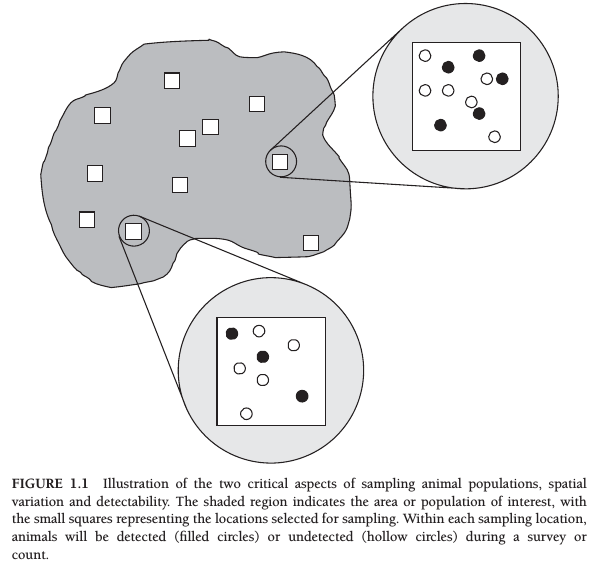
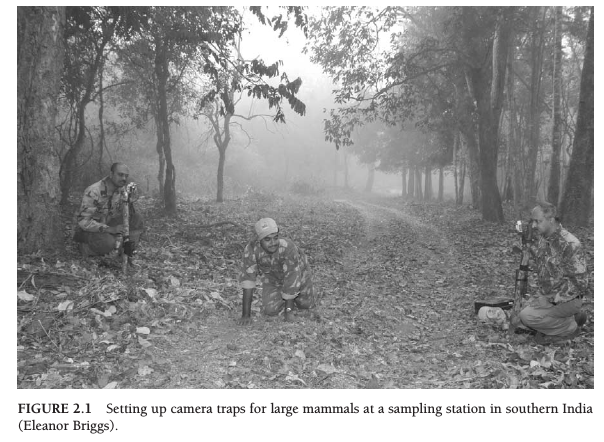
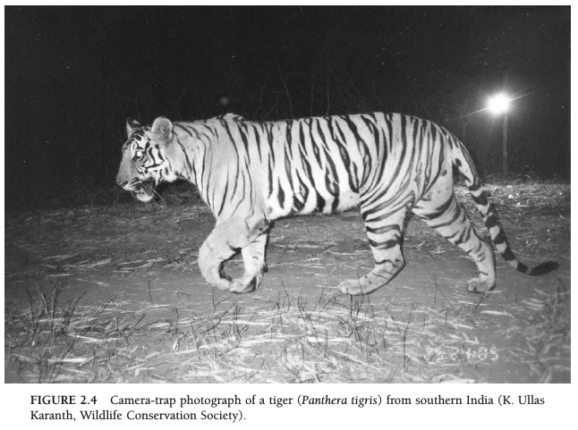
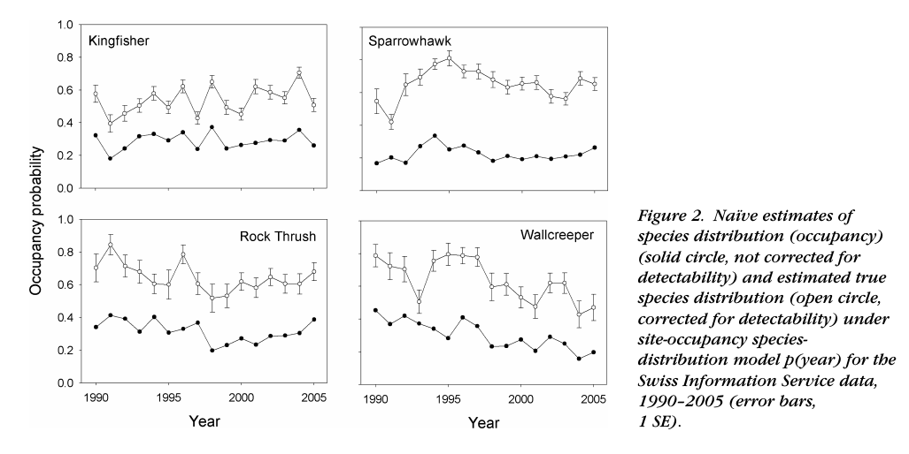
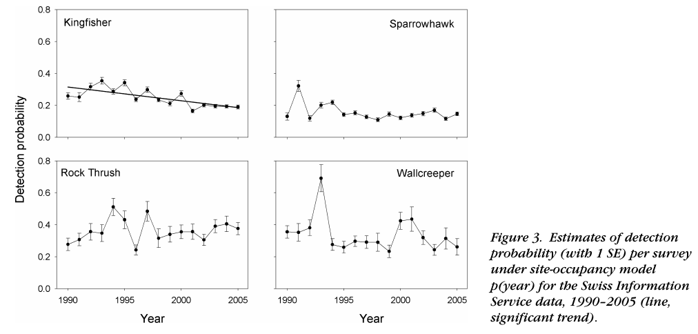

```{r setup, message=FALSE, echo=FALSE, include = FALSE }
rm(list = ls()) ; gc()
library(knitr)
#library(kableExtra)
#library(tidyverse)
library(rstan)
library(bayesplot)
theme_set(bayesplot::theme_default())
options(mc.cores = parallel::detectCores())
rstan_options(auto_write = T)
opts_chunk$set(echo = T, eval = T, cache = T, fig.height = 5)
```

# Introduction

## What is an occupancy model? 

Assume a site occupancy probability $\psi$ and a site detection probability $p$. Introduced by @mackenzie2002estimating

```{r occ_uses1, out.width = "50%", echo=F}

```

From @mackenzie2017occupancy

## Camera traps 

(when we can recognize species not individuals)
```{r occ_uses2, out.width = "75%", echo=F}
#

```

##  eDNA / metabarcoding

Like a camera trap where we would have species ID but not individual ID

## Biased citizen science data

Correcting for changes in detection probability

```{r occ_uses3, out.width = "75%", echo=F}

```

From @kery2010site

## Biased citizen science data

Correcting for changes in detection probability

```{r occ_uses4, out.width = "75%", echo=F}

```

From @kery2010site

## Generated strong debates but now standard

* Do we need to account for Pr(detection)? [@welsh2013fitting, @guillera2014ignoring]

* See [Dynamic ecology blog's perhaps most commented post ](https://dynamicecology.wordpress.com/2013/01/11/is-using-detection-probabilities-a-case-of-statistical-machismo/) and Brian McGill's further comments on 
[Detection probabilities, statistical machismo, and estimator theory](https://dynamicecology.wordpress.com/2014/09/15/detection-probabilities-statistical-machismo-and-estimator-theory/)

* Now standard tools, used whenever variation in Pr(detection) is expected or true occupancy/abundance is needed [@bailey2014advances, @mackenzie2017occupancy]

# The basic occupancy model

## What is an occupancy model? 

Assume a site occupancy probability $\psi$ and a site detection probability $p$. 
We visit several sites and want to know both $\psi$ and $p$. Is that possible? 

## Basic model (1) 

$i$ site index in 1:I

$$
X_i|Z_i \sim \text{Bernoulli}(Z_i p)
$$

$$
Z_i \sim \text{Bernoulli}(\psi)
$$

## Basic model (2) 
One can prove this is equivalent to

$$
X_i \sim \text{Bernoulli}(p \psi)
$$

(btw: true with binomial not just Bernoulli variables)

Problem: $p \psi$ is just one parameter. 

## Basic model (3) 

$i$ site index in 1:I

$t$ visit in 1:T

$$
X_{it}|Z_i \sim \text{Bernoulli}(Z_i p)
$$

$$
Z_i \sim \text{Bernoulli}(\psi)
$$

Robust design (similar to Pollock's design in capture-recapture models). Identifiable now. 

[(McKenzie et al. 2002)](https://esajournals.onlinelibrary.wiley.com/doi/10.1890/0012-9658%282002%29083%5B2248%3AESORWD%5D2.0.CO%3B2)

## Basic model (4) 

Define $Y_i = \sum_{t=1}^{T} X_{it}$. 

$$
Y_{i}|Z_i \sim \text{Binomial}(T,Z_i p)
$$

$$
Z_i \sim \text{Bernoulli}(\psi)
$$

# Implementing this into code

## JAGS/BUGS stuff 

Super easy because we can use discrete latent variables

```{r, eval=F}
model {
  # Priors
    p~dunif(0,1)
    psi~dunif(0,1)
  # Likelihood
    for(i in 1:nsite){
      mu[i]<- p*z[i]
      z[i]~dbern(psi)
      y[i]~dbin(mu[i],T)
      }
    x<-sum(z[])
    }
```


## Simulating the occupancy model

```{r simulating-data}
set.seed(42) 
# Code by Bob Carpenter after Kéry & Schaub's BPA book. 
I <- 250; 
T <- 10;
p <- 0.4;
psi <- 0.3;

z <- rbinom(I,1,psi); # latent occupancy state
y <- matrix(NA,I,T);  # observed state
for (i in 1:I){  y[i,] <- rbinom(T,1,z[i] * p);}

```


## Stan version

Marginalizing the latent discrete state $Z$. Tutorials:

* [J Socolar's guide](https://jsocolar.github.io/occupancyModels/)

* [MB Joseph's guide](https://mbjoseph.github.io/posts/2020-04-28-a-step-by-step-guide-to-marginalizing-over-discrete-parameters-for-ecologists-using-stan/)

Code

* [Richard A. Erickson's code](https://github.com/rerickson-usgs/StanOccupancyModelTutorials)

* [Chapter's 13 of BPA translated to Stan](https://github.com/stan-dev/example-models/tree/master/BPA/Ch.13)

* [Basic occupancy model in Stan classic examples](https://github.com/stan-dev/example-models/blob/master/misc/ecology/occupancy/occupancy.stan) 

## Basic occupancy code

```{stan output.var="occupancy"}
data {
  int<lower=0> I;
  int<lower=0> T;
  int<lower=0,upper=1> y[I,T];
}
parameters {
  real<lower=0,upper=1> psi1;
  real<lower=0,upper=1> p;
}
model {
  // local variables to avoid recomputing log(psi1) and log(1 - psi1)
  real log_psi1;
  real log1m_psi1;
  log_psi1 = log(psi1);
  log1m_psi1 = log1m(psi1);

  // priors
  psi1 ~ uniform(0,1);
  p ~ uniform(0,1);
  
  // likelihood
  for (i in 1:I) {
    if (sum(y[i]) > 0)
      target += log_psi1 + bernoulli_lpmf(y[i] | p);
    else
      target += log_sum_exp(log_psi1 + bernoulli_lpmf(y[i] | p),
			    log1m_psi1);
  }
}
```

## Analysing the occupancy model

```{r fit_model,cache=TRUE,eval=TRUE}
data = list(I=I,T=T,y=y)
## Parameters monitored
params <- c("p", "psi1")
fit <- sampling(occupancy, data = data, iter = 1000, chains = 2, cores = 2)
```

## Analysing the occupancy model

```{r print_model, cache=TRUE,eval=TRUE}
print(fit, probs = c(0.10, 0.5, 0.9))
```

# Real-life example

## What are we studying? 

Bluebug \textit{Rosalia alpina}

```{r bluebug, out.width = "50%", echo=F}
include_graphics("wk12_figs/bluebug.png")
```

## The dataset

* 27 sites (woodpiles), 6 replicated counts for each. 

* Covariates: `forest_edge` (edge or more interior), `dateX`, `hX` (date and hour of day)

* Detection at 10 of 27 woodpiles and from 1 to 5 times

* Questions:
    - Have some bluebugs been likely missed in some sites?
    - How many times should one visit a woodpile?
    - Effect of forest edge?

## Gathering the data

```{r real_life_data,eval=TRUE}
## BPA Kéry & Schaub, translation by Hiroki Itô & Bob Carpenter
## 13.4. Analysis of real data set: Single-season occupancy model

## Read data
## The data file "bluebug.txt" is available at
## http://www.vogelwarte.ch/de/projekte/publikationen/bpa/complete-code-and-data-files-of-the-book.html
data <- read.table("bluebug.txt", header = TRUE)

# Collect the data into suitable structures
y <- as.matrix(data[, 4:9])
y[y > 1] <- 1
edge <- data$forest_edge
dates <- as.matrix(data[, 10:15])
hours <- as.matrix(data[, 16:21])

# Standardize covariates
mean.date <- mean(dates, na.rm = TRUE)
sd.date <- sd(dates[!is.na(dates)])
DATES <- (dates-mean.date) / sd.date
DATES[is.na(DATES)] <- 0

mean.hour <- mean(hours, na.rm = TRUE)
sd.hour <- sd(hours[!is.na(hours)])
HOURS <- (hours-mean.hour) / sd.hour
HOURS[is.na(HOURS)] <- 0

last <- sapply(1:dim(y)[1],
               function(i) max(grep(FALSE, is.na(y[i, ]))))
y[is.na(y)] <- 0

stan_data <- list(y = y, R = nrow(y), T = ncol(y), edge = edge,
                  DATES = DATES, HOURS = HOURS, last = last)

```

## Model specification

```{stan output.var="bluebug"}
// BPA Kéry & Schaub, translation by Hiroki Itô & Bob Carpenter
// Single-season occupancy model
data {
  int<lower=1> R;
  int<lower=1> T;
  int<lower=0,upper=1> y[R, T];
  int<lower=0,upper=1> edge[R];
  matrix[R, T] DATES;
  matrix[R, T] HOURS;
  int last[R];
}

transformed data {
  int<lower=0,upper=T> sum_y[R];
  int<lower=0,upper=R> occ_obs;  // Number of observed occupied sites
  matrix[R, T] DATES2;
  matrix[R, T] HOURS2;

  occ_obs = 0;
  for (i in 1:R) {
    sum_y[i] = sum(y[i]);
    if (sum_y[i])
      occ_obs = occ_obs + 1;
  }
  DATES2 = DATES .* DATES;
  HOURS2 = HOURS .* HOURS;
}

parameters {
  real alpha_psi;
  real beta_psi;
  real alpha_p;
  real beta1_p;
  real beta2_p;
  real beta3_p;
  real beta4_p;
}

transformed parameters {
  vector[R] logit_psi;  // Logit occupancy prob.
  matrix[R, T] logit_p; // Logit detection prob.

  for (i in 1:R)
    logit_psi[i] = alpha_psi + beta_psi * edge[i];
  logit_p = alpha_p
      + beta1_p * DATES + beta2_p * DATES2
      + beta3_p * HOURS + beta4_p * HOURS2;
}

model {
  // Priors
  alpha_psi ~ normal(0, 10);
  beta_psi ~ normal(0, 10);
  alpha_p ~ normal(0, 10);
  beta1_p ~ normal(0, 10);
  beta2_p ~ normal(0, 10);
  beta3_p ~ normal(0, 10);
  beta4_p ~ normal(0, 10);

  // Likelihood
  for (i in 1:R) {
    if (sum_y[i]) { // Occupied and observed
      target += bernoulli_logit_lpmf(1 |  logit_psi[i])
        + bernoulli_logit_lpmf(y[i, 1:last[i]] | logit_p[i, 1:last[i]]);
    } else {        // Never observed
                            // Occupied and not observed
      target += log_sum_exp(bernoulli_logit_lpmf(1 | logit_psi[i])
                            + bernoulli_logit_lpmf(0 | logit_p[i, 1:last[i]]),
                            // Not occupied
                            bernoulli_logit_lpmf(0 | logit_psi[i]));
    }
  }
}

generated quantities {
  real<lower=0,upper=1> mean_p = inv_logit(alpha_p);
  int occ_fs;       // Number of occupied sites
  real psi_con[R];  // prob present | data
  int z[R];         // occupancy indicator, 0/1
  
  for (i in 1:R) {
    if (sum_y[i] == 0) {  // species not detected
      real psi = inv_logit(logit_psi[i]);
      vector[last[i]] q = inv_logit(-logit_p[i, 1:last[i]])';  // q = 1 - p
      real qT = prod(q[]);
      psi_con[i] = (psi * qT) / (psi * qT + (1 - psi));
      z[i] = bernoulli_rng(psi_con[i]);
    } else {             // species detected at least once
      psi_con[i] = 1;
      z[i] = 1;
    }
  }
  occ_fs = sum(z);
}

```

## Model fitting

```{r real_life_data_fitting,cache=TRUE,eval=TRUE}
## Parameters monitored
params <- c("alpha_psi", "beta_psi", "mean_p", "occ_fs",
            "alpha_p", "beta1_p", "beta2_p", "beta3_p", "beta4_p")

## MCMC settings
ni <- 6000
nt <- 5
nb <- 1000
nc <- 4

## Initial values
inits <- lapply(1:nc, function(i)
    list(alpha_psi = runif(1, -3, 3),
         alpha_p = runif(1, -3, 3)))

## Call Stan from R
out <- sampling(bluebug,
            data = stan_data,
            init = inits, pars = params,
            chains = nc, iter = ni, warmup = nb, thin = nt,
            seed = 1,
            control = list(adapt_delta = 0.8),
            open_progress = FALSE)
```

## Model results

```{r results}
print(out, digits = 2)
## Posteriors of alpha_psi and beta_psi will be somewhat different
## from those in the book. This may be because convergences of these
## parameters in WinBUGS are not good, as described in the text.
## JAGS will produce more similar results to Stan.
```

## Overall occupancy

```{r results2}
hist(extract(out, pars = "occ_fs")$occ_fs, nclass = 30, col = "gray")
```

# Dynamic version 

## Dynamic occupancy model

> a.k.a. "Multiple season version". $\psi$ changes between "seasons". 

How do we model this? Similar to metapop models: extinction and colonization probabilities. 

* Pr(colonization of site $i$) = $\gamma_i$ (you can make this dependent on many things)

* Pr(extinction in site $i$) = $\epsilon_i$

See @mackenzie2003estimating, @kery2011bayesian

## Mathematical formulation

$$
Z_{k+1}|Z_k \sim \text{Bernoulli}(\phi_k Z_k + (1-Z_k)\gamma_k)
$$

where $\phi_k = 1-\epsilon_k$. 

You can have $\gamma_k = f(\text{covariates}_k)$ for instance. 

Notations from Kery and Schaub BPA book (@kery2011bayesian). 

```{r, eval=F,echo=F}
Code here if I find the time...
```

## And even more applications...

* Static and dynamic models with covariates

* Multistate models

* Spatial models (random spatial effects, spatial coordinates)

* Multispecies models

* Any combination of the above

## References {#refs}


