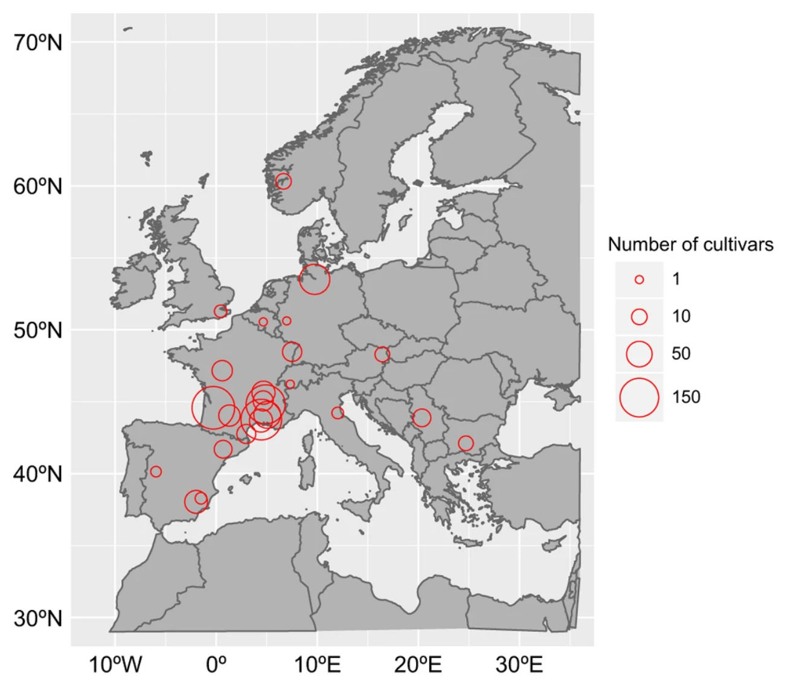

<style>
pre {
  overflow-x: auto;
}
pre code {
  word-wrap: normal;
  white-space: pre;
}
</style>

<style type="text/css">
body{ /* Normal  */
      font-size: 18px;
  }
div.main-container {
  max-width: 2000px;
  margin-left: auto;
  margin-right: auto;
}
</style>


```{css, echo=FALSE}
pre {
  max-height: 300px;
  overflow-y: auto;
}

pre[class] {
  max-height: 600px;
}
```

```{r setup, include=FALSE}
library(knitr)
options(width = 300)
knitr::opts_chunk$set(fig.width = 8, fig.height = 5, cache = F)
library(readxl)
library(rstan)
rstan_options(auto_write = TRUE)
options(mc.cores = parallel::detectCores())
library(bayesplot)
color_scheme_set("green")
library(ggplot2)
library(tibble)
library(dplyr)
library(tidyr)
library(kableExtra)
```

The present workshop is based on the tutorial ["Modèle Hiérarchique avec Stan"](https://stateofther.github.io/post/rstan/WorkingWithStan_part2.html) of Matthieu Authier & Eric Parent.

# The data

In this workshop, we use **flowering date** data collected between 1978 and 2016 and published in @wenden2016collection. Data can be downloaded in [this driad repository](https://datadryad.org/stash/dataset/doi:10.5061/dryad.1d28m). This dataset contains flowering dates of **9,691 indivuals/clones** of 
Prunus avium in Europe. 

Below is a figure from @wenden2016collection showing the 25 studied sites in 11 European countries. Flowering dates were recorded in 12 sites. Size of the circle is proportional to the number of cultivars recorded in each site.

<div align='center'>
  
</div>


```{r LoadData, warning =F,message =F}
dataSakura <- read_excel("data/Sweet_cherry_phenology_data_1978-2015.xlsx", sheet = 1)

dataSakura <- dataSakura[1:1000,] %>% 
  dplyr::rename(Flowering="Full Flowering") %>%       # response variable: the date of flowering
  filter(!is.na(Flowering),!is.na(Plantation)) %>%    # remove missing values
  dplyr::mutate(Age = Year - Plantation,              # create the "age" variable
         Age = ifelse(Age > 14, 14, Age)) %>% 
  dplyr::select(Site,Age,Cultivar,Flowering)          # select the columns we are going to use

# Show the first 10 lines of the dataset
dataSakura[1:10,] %>%
  kable(digits=3) %>%
  kable_styling(font_size=12,
                bootstrap_options = c("striped","hover", "condensed"), full_width = F)
```


Variation in flowering date with tree age (14 age classes):

```{r VariationAge, message=F}
dataSakura %>% 
  group_by(Age) %>% 
  summarize(Effectif = n(),
            Flowering_mean = round(mean(Flowering, na.rm = TRUE), 1)) %>% 
  kable() %>%
  kable_styling(font_size=12,
                bootstrap_options = c("striped","hover", "condensed"), full_width = F)
```

Variation in flowering date by site (12 sites):

```{r VariationSite, message=F}
dataSakura %>% 
  group_by(Site) %>% 
  summarize(Effectif = n(),
            Flowering_mean = round(mean(Flowering, na.rm = TRUE), 1)) %>% 
  kable() %>%
  kable_styling(font_size=12,
                bootstrap_options = c("striped","hover", "condensed"), full_width = F)
```

# The baseline statistical model (introducing the simplex type)

## Background model

We start with a simple model in which we aim to model the flowering date $y_{ijk}$ of each individual $i$ as a function of its age $j$ and its site $k$, such as:

\begin{align}
y_{ijk} & \sim \mathcal{N}(\mu_{ijk},\sigma) \tag*{Likelihood}\\[3pt]
\mu_{ijk} & = \beta_0 + \alpha_j + \delta_k \tag*{Linear model}\\[3pt]
\beta_0 & \sim \mathcal{N}(\mu_y, 10) \tag*{Global intercept prior}\\[3pt]
\alpha_j & \sim \mathcal{N}(0,\sigma_{age})\tag*{Distribution of varying age intercepts}\\[3pt]
\alpha_k & \sim \mathcal{N}(0,\sigma_{site}) \tag*{Distribution of varying site intercepts}\\
\end{align}

We want to specify the priors for $\sigma$, $\sigma_{age}$ and $\sigma_{site}$. For that, we partition the total variance $\sigma_{tot}$ as follows:

\begin{align}
\sigma^2_{tot} & = \sigma^2 + \sigma^2_{age} + \sigma^2_{site}\\[3pt]
\sigma & = \sigma_{tot} \times \sqrt{\pi_1}\\[3pt]
\sigma_{age} & = \sigma_{tot} \times \sqrt{\pi_2}\\[3pt]
\sigma_{site} & = \sigma_{tot} \times \sqrt{\pi_3}\\[3pt]
\end{align}

with $\sum_{l=1}^3\pi_l = 1$ (see the [unit simplex](https://mc-stan.org/docs/2_26/reference-manual/simplex-transform-section.html) in stan) and $\sigma_{tot} \sim \mathcal{S}^+(0,1,3)$ (student prior with 3 degrees of freedom).

This model is an ANOVA with 2 factors (age & site).

## Stan model
```{stan output.var='anova.baseline',eval=F}
/*----------------------- Data --------------------------*/
data {
  int<lower = 1> n_obs;                               // Total number of observations
  int<lower = 1> n_age;                               // Number of different age classes
  int<lower = 1> n_site;                              // Number of different sites
  vector[n_obs] FLOWERING;                            // Response variable (flowering dates)
  int<lower = 1, upper = n_age> AGE[n_obs];           // Age variable
  int<lower = 1, upper = n_site> SITE[n_obs];         // Site variable
  real prior_location_beta0;
  real<lower = 0.0> prior_scale_beta0;
}
/*----------------------- Parameters --------------------------*/
parameters {
  simplex[3] pi;                                      // unit complex specifying that the sum of its elements equal to one.
  real beta0;                                         // global intercept
  real<lower = 0.0> sigma_tot;                        // Total standard deviation
  vector[n_age] alpha;                                // Age intercepts
  vector[n_site] delta;                               // Site intercepts
}
/*------------------- Transformed Parameters --------------------*/
transformed parameters {
  real sigma;                                         // Residual standard deviation
  real sigma_age;                                     // Standard deviation of the age intercepts
  real sigma_site;                                    // Standard deviation of the site intercepts
  vector[n_obs] mu;                                   // linear predictor
  
  sigma = sqrt(pi[1]) * sigma_tot;
  sigma_age = sqrt(pi[2]) * sigma_tot;
  sigma_site = sqrt(pi[3]) * sigma_tot;
  mu = rep_vector(beta0, n_obs) + alpha[AGE] + delta[SITE];
}
/*----------------------- Model --------------------------*/
model {
  // Priors
  beta0 ~ normal(prior_location_beta0, prior_scale_beta0);  // Prior of the global intercept
  sigma_tot ~ student_t(3, 0.0, 1.0);                       // Prior of the total standard deviation
  alpha ~ normal(0.0, sigma_age);                           // Prior of the age intercepts
  delta ~ normal(0.0, sigma_site);                          // Prior of the site intercepts

  // Likelihood
  FLOWERING ~ normal(mu, sigma);
}
/*----------------- Generated Quantities ------------------*/
generated quantities {
  vector[n_obs] log_lik;                    // Log-likelihood
  vector[n_obs] y_rep;                      // posterior predictive check

  for(i in 1:n_obs) {
    log_lik[i] = normal_lpdf(FLOWERING[i]| mu[i], sigma);  // log probability density function
    y_rep[i] = normal_rng(mu[i], sigma);                   // prediction from posterior
  }
}
```

Input data:

```{r ListStan}
list.stan = list(n_obs = nrow(dataSakura),
                 n_age = length(unique(dataSakura$Age)),
                 n_site = length(unique(dataSakura$Site)),
                 FLOWERING = dataSakura$Flowering,
                 AGE = dataSakura$Age,
                 SITE = as.numeric(factor(dataSakura$Site, levels = unique(dataSakura$Site))),
                 prior_location_beta0 = mean(dataSakura$Flowering),
                 prior_scale_beta0 = 10)
```

Compilation:

```{r BaselineModelCompile,message=F,eval=F}
baseline.model <- stan_model("BaselineModelCode.stan")
```

Sampling:

```{r RunBaselineModel,eval=F}
fit.baseline.model <- sampling(baseline.model, 
                               data = list.stan, 
                               pars = c("beta0", "alpha", "delta", "sigma", "sigma_age", "sigma_site", "sigma_tot", "pi", "y_rep", "log_lik"),
                               iter = 2000, chains = 4, cores = 4,thin=1)
saveRDS(fit.baseline.model ,file="BaselineModel.rds")
```

```{r LoadBaselineModel}
fit.baseline.model <- readRDS(file="BaselineModel.rds")
```

## Stan results

Checking parameter convergence:

```{r CheckingConvergence, fig.height=4,fig.height=4,message=F}
stan_rhat(fit.baseline.model)
```

Parameter estimations and importance of each factor (age, site, others) in the total variance:

```{r BaselineModelIntervals, fig.height=4,fig.height=4}
print(fit.baseline.model, digits = 3, pars = c("beta0", "sigma", "sigma_age", "sigma_site", "sigma_tot", "pi"))
#print(fit_1, digits = 3, pars = c("beta0", "alpha", "delta", "sigma", "sigma_age", "sigma_site", "sigma_tot", "pi", "flower_new", "earliest", "latest", "R_squared"))

fit.baseline.model %>%  mcmc_intervals(regex_pars = "^pi",
                    prob=0.95,
                    prob_outer=0.99,
                    point_est = "median") +  theme_bw() +
  theme(axis.text = element_text(size=16))

fit.baseline.model %>%  mcmc_intervals(regex_pars = "^sigma",
                    prob=0.95,
                    prob_outer=0.99,
                    point_est = "median") +  theme_bw() +
  theme(axis.text = element_text(size=16))

lower <- function(x, alpha = 0.8) { coda::HPDinterval(coda::as.mcmc(x), prob = alpha)[1] }
upper <- function(x, alpha = 0.8) { coda::HPDinterval(coda::as.mcmc(x), prob = alpha)[2] }
get_summary <- function(x, alpha = 0.8) { c(mean(x), sd(x), coda::HPDinterval(coda::as.mcmc(x), prob = alpha)) }

summary_anova <- as.data.frame(
  do.call('rbind', lapply(c("sigma", "sigma_age", "sigma_site"),
                          function(param) {
                            get_summary(as.numeric(rstan::extract(fit.baseline.model, param)[[1]]))
                            }
                          )
          )
)

names(summary_anova) <- c("mean", "se", "lower", "upper")
summary_anova$component <- c("residual", "age", "site")

summary_anova %>% 
  mutate(component = factor(component, levels = c("residual", "age", "site")[order(mean)])) %>% 
  ggplot(aes(x = component, y = mean)) +
  geom_linerange(aes(x = component, ymin = lower, ymax = upper)) +
  geom_point(size = 2) +
  ylab("Estimate") + xlab("Source of variation") +
  coord_flip() +
  theme_bw()


```

As sites seem to considerably impact the total variance, we can display the parameters $\delta_k$:

```{r }
freq <- dataSakura %>% 
  group_by(Site) %>% 
  summarize(effectif = n(),
            flowering = mean(Flowering, na.rm = TRUE)
            ) 

moyenne = with(freq, sum(effectif * flowering) / sum(effectif))
freq[6, 1] = "Average"
freq[6, 2] = mean(freq$effectif)
freq[6, 3] = moyenne

post_site <- as.data.frame(t(apply(matrix(rep(rstan::extract(fit.baseline.model, "beta0")$beta0, each = length(unique(dataSakura$Site))), ncol = length(unique(dataSakura$Site)), byrow = TRUE) + rstan::extract(fit.baseline.model, "delta")$delta, 2, get_summary)))
names(post_site) <- c("mean", "se", "lower", "upper")
post_site$where <- c(unique(dataSakura$Site))  #, "Average")
post_site <- cbind(post_site,
                   freq[match(post_site$where, freq$Site), c('flowering', 'effectif')]
                   )

post_site %>% 
  mutate(where = factor(where, levels = c(unique(dataSakura$Site), "Average")[order(mean)])) %>% 
  ggplot(aes(x = where, y = mean)) +
  geom_linerange(aes(x = where, ymin = lower, ymax = upper)) +
  geom_point(size = 2) +
  geom_point(aes(x = where, y = flowering, size = effectif), color = 'red', alpha = 0.3) +
  scale_y_continuous(name = "Estimate (days)", breaks = 95 -10:10) + 
  xlab("Site") +
  coord_flip() +
  theme_bw()
```

Posterior predictive checks:

```{r PPCBaselineModel, fig.height=4,fig.height=4}
ppc_dens_overlay(y = dataSakura$Flowering,
                 as.matrix(fit.baseline.model, pars = "y_rep")[1:50, ]) +
  theme_bw() + 
  theme(legend.text=element_text(size=25), legend.title=element_text(size=18),
        axis.text = element_text(size=18), legend.position = c(0.8,0.6))
```

# The mix model (towards the target function)

## Background model
Let's assume there are two types of cultivars depending on the flowering date : either early or late flowering. 
Let's $p$ be the probability of a late individual $i$ and $1-p$ the probability of an early individual. 

Then, the model becomes:
\begin{align}
y_{ijk} & \sim \mathcal{N}(\mu_{ijk}^l,\sigma) \tag*{Likelihood}\\[3pt]
\mu_{ijk}^l & = \beta_l + \alpha_j + \delta_k \tag*{Linear model}\\[3pt]
\\
\end{align}

with $l \in \{1,2\}$.
Therefore, we introduced a supplementary discrete latent variable: $z_{ijk} \sim \mathcal{B}(p)$ which models the state (early $l=1$ or late $l=2$) according to probability $p$.

As a consequence, the likelihood is:
\begin{align}
\mathcal{L}(y_{ijk}) = (1-p) \times \mathcal{N}(\beta_1 + \alpha_j + \delta_k, \sigma) + p \times \mathcal{N}(\beta_2 + \alpha_j + \delta_k, \sigma)
\\
\end{align}

Thus, the log-likelihood is:
\begin{align}
l(y_{ijk}) = \log{[(1-p) \times \mathcal{N}(\beta_1 + \alpha_j + \delta_k, \sigma) + p \times \mathcal{N}(\beta_2 + \alpha_j + \delta_k, \sigma)]}
\\
\end{align}

## Stan model
Due to the presence of a discrete variable $z_{ijk}$, the likelihood is then implemented using the \textit{target} function instead of $\sim$. 
Note custom-functions can be implemented by using the \textit{function} block:

```{stan output.var='anova.mix',eval=F}
/*--------------------- Functions ------------------------*/
functions {
  real TwoGaussianMixture_lpdf(real y, real prob, vector location, real scale) {
    real log_pdf[2];
    log_pdf[1] = log1m(prob) + normal_lpdf(y| location[1], scale);
    log_pdf[2] = log(prob) + normal_lpdf(y| location[2], scale);
    return log_sum_exp(log_pdf);
  }
  real TwoGaussianMixture_rng(real prob, vector location, real scale) {
    int z;
    z = bernoulli_rng(prob);
    return  z ? normal_rng(location[2], scale) : normal_rng(location[1], scale);
  }
}
/*----------------------- Data --------------------------*/
data {
  int<lower = 1> n_obs;                                              // Total number of observations
  int<lower = 1> n_age;                                              // Number of different age classes
  int<lower = 1> n_site;                                             // Number of different sites
  vector[n_obs] FLOWERING;                                           // Response variable (flowering dates)
  int<lower = 1, upper = n_age> AGE[n_obs];                          // Age variable
  int<lower = 1, upper = n_site> SITE[n_obs];                        // Site variable
  real prior_location_beta0;
  real<lower = 0.0> prior_scale_beta0;
  real prior_location_diff;
  real<lower = 0.0> prior_scale_diff;
}
/*----------------------- Parameters --------------------------*/
parameters {
  real<lower = 0.0, upper = 1.0> p;                                  // proba (early or late flowering)
  simplex[3] pi;                                                     // unit complex specifying that the sum of its elements equal to one.
  real beta0;                                                        // global intercept
  real<lower = 0.0> sigma_tot;                                       // Total standard deviation
  vector[n_age] alpha;                                               // Age intercepts
  vector[n_site] delta;                                              // Site intercepts
  real<lower = 0> difference;                                        // difference between beta_1 and beta_2
}
/*------------------- Transformed Parameters --------------------*/
transformed parameters {
  real sigma;                                                        // Residual standard deviation
  real sigma_age;                                                    // Standard deviation of the age intercepts
  real sigma_site;                                                   // Standard deviation of the site intercepts
  vector[n_obs] mu[2];                                               // linear predictor
  vector[2] beta;
  beta[1] = prior_location_beta0 + beta0 * prior_scale_beta0;
  beta[2] = beta[1] + difference;
  sigma = sqrt(pi[1]) * sigma_tot;
  sigma_age = sqrt(pi[2]) * sigma_tot;
  sigma_site = sqrt(pi[3]) * sigma_tot;
  mu[1] = rep_vector(beta[1], n_obs) + alpha[AGE] + delta[SITE];
  mu[2] = rep_vector(beta[2], n_obs) + alpha[AGE] + delta[SITE];
  //for (i in 1:n_obs) {
  // mu[1, i] = beta[1] + alpha[AGE[i]] + delta[ZONE[i]];
  // mu[2, i] = beta[2] + alpha[AGE[i]] + delta[ZONE[i]];
  //}
}
/*----------------------- Model --------------------------*/
model {
  // Priors
  beta0 ~ normal(0.0, 1.0);
  difference ~ normal(prior_location_diff, prior_scale_diff);
  sigma_tot ~ student_t(3, 0.0, 1.0);                                // Prior of the total standard deviation
  alpha ~ normal(0.0, sigma_age);                                    // Prior of the age intercepts
  delta ~ normal(0.0, sigma_site);                                   // Prior of the site intercepts

  // Likelihood
  for(i in 1:n_obs) {
   //target += log_sum_exp(log1m(p) + normal_lpdf(FLOWERING[i] | mu[1, i], sigma), log(p) + normal_lpdf(FLOWERING[i] | mu[2, i], sigma));
   //target += TwoGaussianMixture_lpdf(FLOWERING[i]| p, to_vector(mu[1:2, i]), sigma);
   FLOWERING[i] ~ TwoGaussianMixture(p, to_vector(mu[1:2, i]), sigma);
  }
}
/*----------------- Generated Quantities ------------------*/
generated quantities {
  vector[n_obs] log_lik;                                             // Log-likelihood
  vector[n_obs] y_rep;                                               // posterior predictive check

  for(i in 1:n_obs) {
   log_lik[i] = log_sum_exp(log1m(p) + normal_lpdf(FLOWERING[i] | mu[1, i], sigma),
   log(p) + normal_lpdf(FLOWERING[i] | mu[2, i], sigma));
   y_rep[i] = TwoGaussianMixture_rng(p, to_vector(mu[1:2, i]), sigma);
  }
}
```

Input data:

```{r ListMixStan}
listMix.stan = list(n_obs = nrow(dataSakura),
                 n_age = length(unique(dataSakura$Age)),
                 n_site = length(unique(dataSakura$Site)),
                 FLOWERING = dataSakura$Flowering,
                 AGE = dataSakura$Age,
                 SITE = as.numeric(factor(dataSakura$Site, levels = unique(dataSakura$Site))),
                 prior_location_beta0 = mean(dataSakura$Flowering),
                 prior_scale_beta0 = 10,
                 prior_location_diff = 7,
                 prior_scale_diff = 3)
```

Compilation:

```{r mixTargetModelCompile,message=F,eval=F}
mixTarget.model <- stan_model("MixModelCode_target.stan")
```

Sampling:

```{r RunMixTargetModel,eval=F}
fit.mixTarget.model <- sampling(mixTarget.model, 
                               data = listMix.stan, 
                               pars = c("p", "beta", "alpha", "delta", "sigma", "sigma_age", "sigma_site", "sigma_tot", "pi", "difference", "y_rep", "log_lik"),
                               iter = 2000, chains = 4, cores = 4,thin=1)
saveRDS(fit.mixTarget.model ,file="mixTargetModel.rds")
```

Compilation (with the function block):

```{r mixTargetGaussianModelCompile,message=F,eval=F}
mixTargetGaussian.model <- stan_model("MixModelCode_targetGaussianMixture.stan")
```

Sampling (with the fuctin block):

```{r RunMixTargetGaussianModel,eval=F}
fit.mixTargetGaussian.model <- sampling(mixTargetGaussian.model, 
                               data = listMix.stan, 
                               pars = c("p", "beta", "alpha", "delta", "sigma", "sigma_age", "sigma_site", "sigma_tot", "pi", "difference", "y_rep", "log_lik"),
                               iter = 2000, chains = 4, cores = 4,thin=1)
saveRDS(fit.mixTargetGaussian.model ,file="mixTargetGaussianMixtureModel.rds")
```

```{r LoadmixTargetModel}
fit.mixTarget.model <- readRDS(file="mixTargetModel.rds")
```

```{r LoadmixTargetModel2}
fit.mixTargetGaussianMixture.model <- readRDS(file="mixTargetGaussianMixtureModel.rds")
```

## Stan results

Checking parameter convergence:

```{r CheckingConvergence2, fig.height=4,fig.height=4,message=F}
stan_rhat(fit.mixTarget.model)
```

```{r CheckingConvergence2.2, fig.height=4,fig.height=4,message=F}
stan_rhat(fit.mixTargetGaussianMixture.model)
```

Parameter estimations:

```{r mixTargetModelIntervals, fig.height=4,fig.height=4}
print(fit.mixTarget.model, digits = 3, pars = c("p", "beta", "sigma", "sigma_age", "sigma_site", "sigma_tot", "pi", "difference"))
```

```{r mixTargetModelIntervals2, fig.height=4,fig.height=4}
print(fit.mixTargetGaussianMixture.model, digits = 3, pars = c("p", "beta", "sigma", "sigma_age", "sigma_site", "sigma_tot", "pi", "difference"))
```

Comparison of the estimation of the log-likelihood between the baseline and the mix models (using WAIC):

```{r comparison}
loo::compare(loo::waic(rstan::extract(fit.baseline.model, "log_lik")$log_lik),
             loo::waic(rstan::extract(fit.mixTarget.model, "log_lik")$log_lik)
             )
```

Importance of each factor (age, site, others) in the total variance:

```{r sigma}
summary_anova <- as.data.frame(
  do.call('rbind', lapply(c("sigma", "sigma_age", "sigma_site"),
                          function(param) {
                            get_summary(as.numeric(rstan::extract(fit.mixTarget.model, param)[[1]]))
                            }
                          )
          )
)

names(summary_anova) <- c("mean", "se", "lower", "upper")
summary_anova$component <- c("residual", "age", "site")

summary_anova %>% 
  mutate(component = factor(component, levels = c("residual", "age", "site")[order(mean)])) %>% 
  ggplot(aes(x = component, y = mean)) +
  geom_linerange(aes(x = component, ymin = lower, ymax = upper)) +
  geom_point(size = 2) +
  ylab("Estimate") + xlab("Source of variation") +
  coord_flip() +
  theme_bw()
```

# Cultivar and flowering (inclusion of covariables)

Cultivars are now considered as predictor variables for estimating the latent state $z_{ijk}$.

## Background model

Now, the latent discrete variable $z_{ijk}$ is recovered by using predictors such as the different cultivars (~190). The logistic regression can be written as:
\begin{align}
z_{ijk} &\sim \mathcal{B}(p_i) \\
logit(p_i) &= \eta_0 + \eta_{Cultivar}
\\
\end{align}

## Stan model
```{stan output.var='anova.mix',eval=F}
/*--------------------- Functions ------------------------*/
functions {
  real TwoGaussianMixture_lpdf(real y, real prob, vector location, real scale) {
    real log_pdf[2];
    log_pdf[1] = log1m(prob) + normal_lpdf(y| location[1], scale);
    log_pdf[2] = log(prob) + normal_lpdf(y| location[2], scale);
    return log_sum_exp(log_pdf);
  }
  real TwoGaussianMixture_rng(real prob, vector location, real scale) {
    int z;
    z = bernoulli_rng(prob);
    return  z ? normal_rng(location[2], scale) : normal_rng(location[1], scale);
  }
}
/*----------------------- Data --------------------------*/
data {
  int<lower = 1> n_obs;                                              // Total number of observations
  int<lower = 1> n_age;                                              // Number of different age classes
  int<lower = 1> n_site;                                             // Number of different sites
  int<lower = 1> n_cultivar;                                         // Number of different cultivars
  vector[n_obs] FLOWERING;                                           // Response variable (flowering dates)
  int<lower = 1, upper = n_age> AGE[n_obs];                          // Age variable
  int<lower = 1, upper = n_site> SITE[n_obs];                        // Site variable
  int<lower = 1, upper = n_cultivar> CULTIVAR[n_obs];                // Cultivar variable
  real prior_location_beta0;
  real<lower = 0.0> prior_scale_beta0;
  real prior_location_diff;
  real<lower = 0.0> prior_scale_diff;
  real prior_location_eta0;
  real<lower = 0.0> prior_scale_eta0;
}
/*----------------------- Parameters --------------------------*/
parameters {
  simplex[3] pi;                                                     // unit complex specifying that the sum of its elements equal to one.
  real beta0;                                                        // global intercept
  real<lower = 0.0> sigma_tot;                                       // Total standard deviation
  vector[n_age] alpha;                                               // Age intercepts
  vector[n_site] delta;                                              // Site intercepts
  real<lower = 0> difference;                                        // difference between beta_1 and beta_2
  real<lower = 0.0> sigma_cultivar;
  real eta0;
  vector[n_cultivar] eta;
}
/*------------------- Transformed Parameters --------------------*/
transformed parameters {
  real sigma;                                                        // Residual standard deviation
  real sigma_age;                                                    // Standard deviation of the age intercepts
  real sigma_site;                                                   // Standard deviation of the site intercepts
  vector[n_obs] mu[2];                                               // linear predictor
  vector[n_obs] p;                                                   // proba (early or late flowering)
  vector[2] beta;
  beta[1] = prior_location_beta0 + beta0 * prior_scale_beta0;
  beta[2] = beta[1] + difference;
  sigma = sqrt(pi[1]) * sigma_tot;
  sigma_age = sqrt(pi[2]) * sigma_tot;
  sigma_site = sqrt(pi[3]) * sigma_tot;
  mu[1] = beta[1] + alpha[AGE] + delta[SITE];
  mu[2] = beta[2] + alpha[AGE] + delta[SITE];
  p = inv_logit(rep_vector(eta0, n_obs) + eta[CULTIVAR]);
}
/*----------------------- Model --------------------------*/
model {
  // Priors
  sigma_tot ~ student_t(3, 0.0, 1.0);
  sigma_cultivar ~ student_t(3, 0.0, 1.0);
  beta0 ~ normal(0.0, 1.0);
  difference ~ normal(prior_location_diff, prior_scale_diff);
  alpha ~ normal(0.0, sigma_age);
  delta ~ normal(0.0, sigma_site);
  eta0 ~ normal(prior_location_eta0, prior_scale_eta0);
  eta ~ normal(0.0, sigma_cultivar);

  // Likelihood
  for(i in 1:n_obs) {
    target += log_sum_exp(log1m(p[i]) + normal_lpdf(FLOWERING[i] | mu[1, i], sigma),
    log(p[i]) + normal_lpdf(FLOWERING[i] | mu[2, i], sigma));
  }
}
/*----------------- Generated Quantities ------------------*/
generated quantities {
  vector[n_obs] log_lik;                                             // Log-likelihood
  vector[n_obs] y_rep;                                               // posterior predictive check

  for(i in 1:n_obs) {
    log_lik[i] = log_sum_exp(log1m(p[i]) + normal_lpdf(FLOWERING[i] | mu[1, i], sigma),
    log(p[i]) + normal_lpdf(FLOWERING[i] | mu[2, i], sigma));
    y_rep[i] = TwoGaussianMixture_rng(p[i], to_vector(mu[1:2, i]), sigma);
  }
}
```

Input data:

```{r ListMixCultivarStan}
listMixCultivar.stan = list(n_obs = nrow(dataSakura),
                 n_age = length(unique(dataSakura$Age)),
                 n_site = length(unique(dataSakura$Site)),
                 n_cultivar = length(unique(dataSakura$Cultivar)),
                 FLOWERING = dataSakura$Flowering,
                 AGE = dataSakura$Age,
                 SITE = as.numeric(factor(dataSakura$Site, levels = unique(dataSakura$Site))),
                 CULTIVAR = as.numeric(factor(dataSakura$Cultivar, levels = unique(dataSakura$Cultivar))),
                 prior_location_beta0 = mean(dataSakura$Flowering),
                 prior_scale_beta0 = 10,
                 prior_location_diff = 7,
                 prior_scale_diff = 3,
                 prior_location_eta0 = 0.0,
                 prior_scale_eta0 = 1.5)
```

Compilation:

```{r mixModelCultivarCompile,message=F,eval=F}
mixCultivar.model <- stan_model("MixModelCultivarCode.stan")
```

Sampling:

```{r RunMixCultivarModel,eval=F}
fit.mixCultivar.model <- sampling(mixCultivar.model, 
                               data = listMixCultivar.stan, 
                               pars = c("eta0", "eta", "sigma_cultivar", "beta", "alpha", "delta", "sigma", "sigma_age", "sigma_site", "sigma_tot", "pi", "difference", "log_lik"),
                               #pars = c("p", "beta", "alpha", "delta", "sigma", "sigma_age", "sigma_site", "sigma_tot", "pi", "difference", "y_rep", "log_lik"),
                               iter = 2000, chains = 4, cores = 4,thin=1)
saveRDS(fit.mixCultivar.model ,file="mixModelCultivar.rds")
```

```{r LoadmixModelCultivar}
fit.mixCultivar.model <- readRDS(file="mixModelCultivar.rds")
```

## Stan results

Checking parameter convergence:

```{r CheckingConvergence3, fig.height=4,fig.height=4,message=F}
stan_rhat(fit.mixCultivar.model)
```

Parameter estimations:

```{r mixCultivarModelIntervals, fig.height=4,fig.height=4}
print(fit.mixCultivar.model, digits = 3, pars = c("eta0", "sigma_cultivar", "beta", "sigma", "sigma_age", "sigma_site", "sigma_tot", "pi", "difference"))
```

Comparison of the estimation of the log-likelihood between the two mix models (w or w/o cultivar variables):

```{r comparison2}
loo::compare(loo::waic(rstan::extract(fit.mixTarget.model, "log_lik")$log_lik),
             loo::waic(rstan::extract(fit.mixCultivar.model, "log_lik")$log_lik)
             )
```

Finally, we can display the correlation between cultivars and the probability of late flowering:

```{r cultivars}
proba_late <- plogis(matrix(rep(rstan::extract(fit.mixCultivar.model, "eta0")$eta0, each = length(unique(dataSakura$Cultivar))), byrow = FALSE, ncol = length(unique(dataSakura$Cultivar))) + rstan::extract(fit.mixCultivar.model, "eta")$eta)

data.frame(id = unique(dataSakura$Cultivar),
                       proba = apply(proba_late, 2, mean),
                       lower = apply(proba_late, 2, lower),
                       upper = apply(proba_late, 2, upper)
                       ) %>% 
  mutate(id = factor(id, levels = id[order(proba)])) %>% 
  ggplot(aes(x = id, y = proba)) +
  geom_linerange(aes(x = id, ymin = lower, ymax = upper)) +
  geom_point() +
  xlab("cultivar") + ylab("Pr(Late Flowering)") +
  coord_flip() +
  theme(axis.text.y = element_text(size = 6))
```

# References
