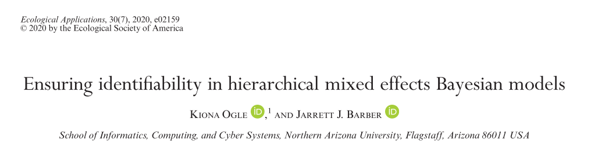
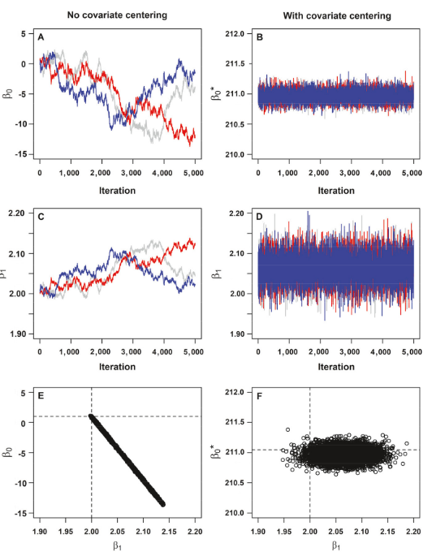
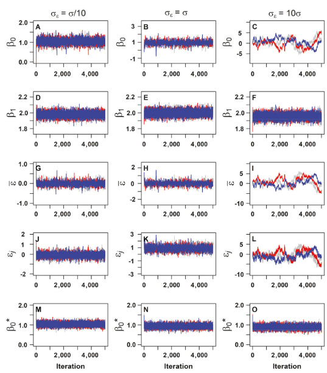
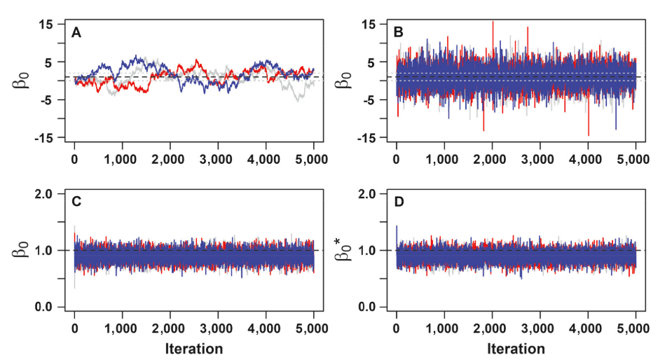
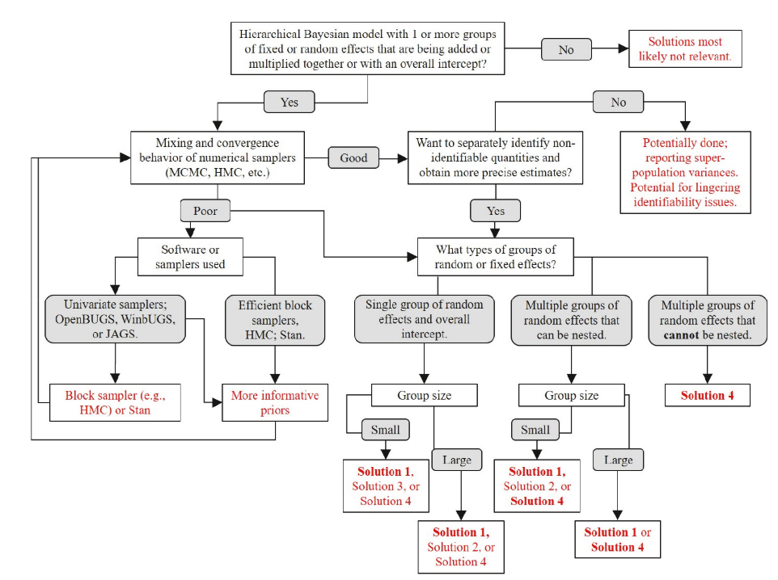

```{r setup, include=FALSE}
knitr::opts_chunk$set(echo = FALSE)
# library(rjags)
```

Disclaimer: most texts are copy-pasted from the original paper (Ogle and Barber 2020).

## Introduction

{width=100% }

- **Non-identifiability of parameters** refers to a constancy in the posterior probability or likelihood with changes in the parameters, but we broadly consider (non) identifiability as the (in)ability of models, data, or implementation to inform about effects of interests.
- For example, a model may be **over-parameterized**, whereby a change in one parameter compensates exactly for the change in posterior probabibility or likelihood caused by a change in another parameter.
- However, we consider mostly cases wherein parameters are **"weakly”** identifiable, wherein the parameters are correlated within an MCMC chain:

{width=30%}

## Frenquentist way

- Typical frequentist implementations or software packages solve such identifiability problems by **implementing constraints** within the analysis and software.
- For instance: the effect associated with a factor’s first level is constrained to zero  ⮕ the factor’s first level is interpreted as a reference level.

## The identifiability problem

Let us consider the linear model:
$\mu_i = \beta_0 + \beta_1x_i + \varepsilon_{j(i)}$

- $\beta_0$ : overall intercept
- $\varepsilon_j$ is a random effect for each group level $j$: $\varepsilon_j \sim Normal(0,\sigma^2_{\varepsilon})$
- relatively non-informative prior for $\beta_0$ and $\beta_1$ (Normal)
- variances $\sigma^2$ and $\sigma^2_{\varepsilon}$ are assigned relatively non-informative, conjugate prior, or semi-informative prior that **reduce the probability of unrealistically large values**.

## Centering the covariates

It may be difficult to individually estimate $\beta_0$ (intercept) and $\beta_1$ (slope) if the observed values of $x_i$ are “far from” zero.

{width=75%}


## HMC or block-wise samplers

- Many MCMC sampling algorithms, such as most of the univariate algorithms in JAGS or OpenBUGS, move through the posterior parameter space by taking steps in the direction of each parameter’s coordinate axes, one parameter at a time, to a new coordinate value that is associated with a somewhat minor change in the posterior density. Correlation and/or near non-identifiability among parameters cause long, narrow regions or “ridges” in the parameter space wherein the posterior is concentrated. Thus, moving too much in a coordinate axes direction can quickly send the sampling algorithm up/down a steep posterior cliff, and **sampling steps are made small** to avoid this, which is revealed in chains that move slowly (poor mixing).

- Algorithms that move groups of parameters simultaneously, such as **Hamiltonian Monte Carlo** or other block-wise samplers, are expected to show improved mixing as they can usually take “larger” steps in the multivariate parameter space.

## Variance of the random effects

```{r cars, echo = FALSE, message=FALSE}
# library(rjags)
library(ggplot2)

# Load data: x = x variable, y1 = y variable with sig.eps = 0.1
# y2 = y with sig.eps = 1, and y3 = y with sig.eps = 10.

load("data/Data S1.RData")

sig <- c(rep(0.1,length(y1)), rep(1,length(y2)), rep(10,length(y3)))
sigma <- c(rep(1,length(y1)), rep(2,length(y2)), rep(3,length(y3)))

ggplot() + aes(x = c(x,x,x), y = c(y1,y2,y3), col = sigma) + geom_point()

# Create data lists for JAGS (or OpenBUGS) model:
# Small sig.eps:
data1 = list(y = y1, x = x)
# If using folded-Cauchy prior:
#data1 = list(y = y1, x = x, a = 0.5, b = 1/2)

# Medium sig.eps:
data2 = list(y = y2, x = x)
# If using folded-Cauchy prior:
#data2 = list(y = y2, x = x, a = 0.5, b = 1/2)

# Large sig.eps:
data3 = list(y = y3, x = x)
# If using folded-Cauchy prior:
#data3 = list(y = y3, x = x, a = 0.5, b = 1/2)

```

### Model

```{r model0, echo=T}
mod.string <- "
model{
  for(j in 1:10){
    for(r in 1:10){
      # Likelihood of (stochastic) data:
      y[r,j] ~ dnorm(mu[r,j],tau)
      # Mean model for a random effects regression:
      mu[r,j] <- b0 + b1*x[r,j] + eps[j]
    }
    # Zero-centered hierarchical prior for random effects:
    eps[j] ~ dnorm(0,tau.eps)
  }
  # Relatively non-informative priors for root nodes:
  b0 ~ dnorm(0,1E-6)
  b1 ~ dnorm(0,1E-6)
  tau ~ dgamma(0.1, 0.1)
  sig <- 1/sqrt(tau)
  
  # Conjugate gamma prior for precision:
  tau.eps ~ dgamma(0.1, 0.1)
  sig.eps <- 1/sqrt(tau.eps)
  
  # Folded Cauchy(0,A^2,df=1) prior for standard deviation:
  # alpha ~ dnorm(0,1)
  # tau.temp ~ dgamma(a,b)
  # sig.temp <- 1/sqrt(tau.temp)
  # sig.eps <- abs(alpha)*sig.temp
  # tau.eps <- pow(sig.eps,-2)

  # Compute mean of random effects (to illustrate non-identifiability)
  mean.eps <- mean(eps[])
}"

```

### Fit the model to the three different datasets

- First model, $\sigma_{\varepsilon} = \sigma/10$

```{r model1, echo=T, message=FALSE, eval=F}
load.module("dic")


mod <- textConnection(mod.string)
n.adapt = 1000
n.chains = 3
n.iter = 10000
jm1 =jags.model(mod,
                 data=data1,
                 n.chains=n.chains,
                 n.adapt=n.adapt)
# If using folded-Cauchy prior, may need to provide jags.model with initials for related parameters, such as:
# inits = list(list(alpha = 0.5, tau.temp = 1), list(alpha = 1.5, tau.temp = 0.1), 
#             list(alpha = 2, tau.temp = 1.5))
coda1 = coda.samples(jm1,variable.names=c("deviance","b0","b1","sig","sig.eps", "mean.eps","eps"),
                   n.iter=n.iter)
```

- Second model, $\sigma_{\varepsilon} = \sigma$

```{r model2, echo=T, message=FALSE, eval=F}
mod <- textConnection(mod.string)
jm2 =jags.model(mod,
                data=data2,
                n.chains=n.chains,
                n.adapt=n.adapt)
# If using folded-Cauchy prior, may need to provide initials, as indicated above.
coda2 = coda.samples(jm2,variable.names=c("deviance","b0","b1","sig","sig.eps", "mean.eps","eps"),
                     n.iter=n.iter)
```

- Third model, $\sigma_{\varepsilon} = 10 \sigma$

```{r model3, echo=T, message=FALSE, eval=F}
mod <- textConnection(mod.string)
jm3 =jags.model(mod,
                data=data3,
                n.chains=n.chains,
                n.adapt=n.adapt)
# If using folded-Cauchy prior, may need to provide initials, as indicated above.
coda3 = coda.samples(jm3,variable.names=c("deviance","b0","b1","sig","sig.eps", "mean.eps","eps"),
                     n.iter=n.iter)
```

Compute Raftery diagnostic to determine number of MCMC iterations required:

```{r raft, echo=T, eval=F}
raft1 <- raftery.diag(coda1)
raft2 <- raftery.diag(coda2)
raft3 <- raftery.diag(coda3)
```

Update models according to number of samples required (based on Raftery):

```{r Update, echo=T, eval=F}
n.iter1 = 190000/3
coda1up = coda.samples(jm1,variable.names=c("deviance","b0","b1","sig","sig.eps", "mean.eps", "eps"),
                     n.iter=n.iter1)
n.iter2 = 80000/3
coda2up = coda.samples(jm2,variable.names=c("deviance","b0","b1","sig","sig.eps", "mean.eps","eps"),
                       n.iter=n.iter2)
n.iter3 = 400000/3
coda3up = coda.samples(jm3,variable.names=c("deviance","b0","b1","sig","sig.eps", "mean.eps","eps"),
                       n.iter=n.iter3)
```

### MCMC plots
```{r plotresult, echo=T, eval=F}
# library(mcmcplots)
# mcmcplot(window(coda1up,thin=100))
# mcmcplot(window(coda2up,thin=40))
# mcmcplot(window(coda3up,thin=100))
```
{width=100%}

## Specification of more informative priors

- A potentially easy solution to reducing the posterior correlation between, and thus enabling estimation of, the overall intercept $\beta_0$ and the additive random effects $\varepsilon_j$ is to specify more informative priors for $\beta_0$ and/or $\sigma_{\varepsilon}$.
- For the simple random effects regression, Lemoine (2019) recommends using a Cauchy(0,1) prior, folded at zero, for $\sigma_{\varepsilon}$.
- While the use of a folded Cauchy(0,1) prior did shrink the marginal posterior for $\sigma_{\varepsilon}$ toward smaller values, it did not notably improve mixing or convergence of the MCMC chains.
- When prior information is available to construct such informative priors, **we agree that such information should be leveraged**, partly to address potential identifiability issues.

## Reparameterization or coding solutions

### Hierarchical centering

We can simply combine the intercept and random effects:
$$ \mu_i = \alpha_{j(i)} + \beta_1 x_i $$
Then, we assign a hierarchically centered prior to $\alpha_j$:
$$ \alpha_j \sim Normal(\beta_0, \sigma^2_{\varepsilon})$$

Reparameterization by hierarchical centering does not alter the underlying statistical model, but it allows us to identify $\beta_0$ and individual $\varepsilon_j$, which are computed as $\varepsilon_j = \alpha_j - \beta_0$.

However, the 95% CI for $\beta_0$ is comparable to the original non-identifiable model, indicating that the precision of $\beta_0$ is generally not improved by this solution.

JAGS code for hierarchical centering:
```{r hc, echo=T}
mod.string.hc <- "
model{
  for(j in 1:10){
    for(r in 1:10){
      y[r,j] ~ dnorm(mu[r,j],tau)
      # Mean model differs from the original, non-identifiable model:
      mu[r,j] <- b0.eps[j] + b1*x[r,j]
    }
    # Hierarchical prior for random effects, centered on overall intercept (mean):
    b0.eps[j] ~ dnorm(b0,tau.eps)
    # If interested in monitoring the random effects, can
    # compute as a deviation term (but, not necessary)
    eps[j] <- b0.eps[j] - b0
  }
  # Relatively non-informative priors for root nodes:
  b0 ~ dnorm(0,1E-6)
  b1 ~ dnorm(0,1E-6)
  tau ~ dgamma(0.1, 0.1)
  sig <- 1/sqrt(tau)
  # Mean of random effects (not necessary):
  mean.eps <- mean(eps[])

  # Conjugate gamma prior for random effects precision:
  tau.eps ~ dgamma(0.1, 0.1)
  sig.eps <- 1/sqrt(tau.eps)

  # Folded Cauchy(0,A^2,df=1) prior for standard deviation:
  # alpha ~ dnorm(0,1)
  # tau.temp ~ dgamma(a,b)
  # sig.temp <- 1/sqrt(tau.temp)
  # sig.eps <- abs(alpha)*sig.temp
  # tau.eps <- pow(sig.eps,-2)

}
"
```

Implement Bayesian model with hierarchical centering, with the different datasets

```{r hc_run, echo=T, eval=F}

# for "small" sig.eps
data.soln = data1
# for "medium" sig.eps
data.soln = data2
# for "large" sig.eps
data.soln = data3

# Set arguments for jag.model function:
n.adapt = 5000
n.chains = 3
n.iter = 10000

### First: hierarhical centering:
mod.hc <- textConnection(mod.string.hc)
jm.hc =jags.model(mod.hc,
                data=data.soln,
                n.chains=n.chains,
                n.adapt=n.adapt)
# If using folded-Cauchy prior, may need to provide jags.model with initials for related parameters, such as:
# inits = list(list(alpha = 0.5, tau.temp = 1), list(alpha = 1.5, tau.temp = 0.1), 
#             list(alpha = 2, tau.temp = 1.5))
coda.hc = coda.samples(jm.hc,variable.names=c("deviance","b0","b1","sig","sig.eps", "mean.eps",
                                              "eps"),
                     n.iter=n.iter)

# mcmcplot(window(coda.hc,thin=10))
```

### Sum-to-zero constraint

For the simple linear model: $\varepsilon_j \sim Normal(0,\sigma^2_{\varepsilon})$ for $j=1,2,...,J-1$
and $\varepsilon_J = -\sum^{J-1}_{j=1}\varepsilon_j$

- This solution resulted in posterior estimates for all quantities that agree with the true values (the truth is contained in the 95% CIs), with the exception of $\sigma_{\varepsilon}$, which was slightly underestimated for true $\sigma_{\varepsilon} = 0.1$ and slightly overestimated for true $\sigma_{\varepsilon} = 10$.
- Importantly, the sum-to-zero constraint results in notable **improvements in mixing and convergence of the MCMC chains**, and the 95% CI for $\beta_0$ is notably narrower (more precise) than the original and hierarchical centering approaches.
- The sum-to-zero solution, however, is **not appropriate for small group sizes** (e.g., J < 5 or 10).

JAGS code for sum-to-zero constraint:
```{r sz, echo=T, eval=F}

mod.string.sz <-"
  model{
    for(j in 1:10){
      for(r in 1:10){
        y[r,j] ~ dnorm(mu[r,j],tau)
        # Mean model the same as the original, non-identifiable model:
        mu[r,j] <- b0 + b1*x[r,j] + eps[j]
      }
    }
    
    # Hierarchical prior for all but one random effect:
    for(j in 1:9){
      eps[j] ~ dnorm(0,tau.eps)
    }
    # Remaining random effect = minus sum of other random effects:
    eps[10] <- -sum(eps[1:9])
    
    # Relatively non-informative priors for root nodes:
    b0 ~ dnorm(0,1E-6)
    b1 ~ dnorm(0,1E-6)
    tau ~ dgamma(0.1, 0.1)
    sig <- 1/sqrt(tau)
    # Mean of the random effects (not necessary), which will be exactly zero:
    mean.eps <- mean(eps[])
    
    # Conjugate gamma prior for random effects precision:
    tau.eps ~ dgamma(0.1, 0.1)
    sig.eps <- 1/sqrt(tau.eps)
    
    # Folded Cauchy(0,A^2,df=1) prior for standard deviation:
    # alpha ~ dnorm(0,1)
    # tau.temp ~ dgamma(a,b)
    # sig.temp <- 1/sqrt(tau.temp)
    # sig.eps <- abs(alpha)*sig.temp
    # tau.eps <- pow(sig.eps,-2)
    
  }
"
```

Implement Bayesian model with sum-to-zero constraint,

```{r sz_run, echo=T, eval=F}
mod.sz <- textConnection(mod.string.sz)
jm.sz =jags.model(mod.sz,
                  data=data.soln,
                  n.chains=n.chains,
                  n.adapt=n.adapt)
# If using folded-Cauchy prior, may need to provide initials, as indicated above.
coda.sz = coda.samples(jm.sz,variable.names=c("deviance","b0","b1","sig","sig.eps", "mean.eps",
                                              "eps"),
                       n.iter=n.iter)

# mcmcplot(window(coda.sz,thin=10))
```

### Reparameterization by sweeping

- In general, the sum-to-zero constraint results in negative correlations among the $\varepsilon_j$ terms, and the strength of this correlation increases with smaller J.
- Gilks and Roberts (1996) give an analytical solution for the correlation among pairs of such constrained random effects, which leads to modeling the vector of J-1 $\varepsilon_j$ terms as coming from a multivariate normal distribution with a covariance matrix $\Sigma$ that explicitly accounts for the induced correlation among the $\varepsilon_j$ terms:
$$ \varepsilon_{-J} \sim Normal_{J-1}(0,\Sigma) $$
$$\sum_{j,k} = -\frac{\sigma^2_{\varepsilon}}{J}$$
for $i \ne k$ and $\sum_{j,j} = \sigma^2_{\varepsilon}$ and
$$ \varepsilon_J = - \sum_{j=1}^{J-1}\varepsilon_j $$ 

- The sum-to-zero constraint and associated sweeping of the random effects mean requires some additional coding steps upon implementation in software such as OpenBUGS, JAGS, or Stan (or via one’s own custom MCMC routine).
- For large J, however, we may simply use sum-to-zero.

### Post-sweeping of random effects

This solution retains the original parameterization involving the non-identifiable intercept and random effects. However, these non-identifiable quantities are only used to **compute relevant identifiable quantities** that we store, monitor, evaluate, summarize, and report.

We compute the identifiable intercept $\beta^*_0$ and random effects $\varepsilon^*_j$ as : $\varepsilon^*_j = \varepsilon_j - \overline{\varepsilon}$ for $j = 1,2,...,J$ where $\overline{\varepsilon} = \frac{1}{J}\sum^J_{j=1}\varepsilon_j$
and $\beta^*_0 = \beta_0 + \overline{\varepsilon}$

The identifiable terms are considered derived quantities and their solutions can be programmed directly into the model code.

Convergence of the identifiable quantities produced by this solution are much improved and comparable to Solutions 1 (hierarchical centering) and 2 (sum-to-zero constraint).

JAGS code for post-sweeping of random effects:
```{r ps, echo=T}

mod.string.ps <- "
  model{
    for(j in 1:10){
      for(r in 1:10){
        y[r,j] ~ dnorm(mu[r,j],tau)
        # Mean model same as original, non-identifiable model:
        mu[r,j] <- b0 + b1*x[r,j] + eps[j]
      }
      # Zero-centered hierarchical prior for random effects, just
      # as used in the original model (do not monitor or report these):
      eps[j] ~ dnorm(0,tau.eps)
      # Compute identifiable random effects (monitor and report these,
      # if desired):
      eps.star[j] <- eps[j] - mean.eps
    }
    # Prior for non-identifiable intercept (don't monitor or report)
    b0 ~ dnorm(0,1E-6)
    # Compute identifiable intercept (monitor and report this):
    b0.star <- b0 + mean.eps
    # Relatively non-informative priors for other root nodes:
    b1 ~ dnorm(0,1E-6)
    tau ~ dgamma(0.1, 0.1)
    sig <- 1/sqrt(tau)
    # Mean of non-identifiable random effects (required)
    mean.eps <- mean(eps[])
    # Mean of identifiable random effects (not required), will be exactly zero.
    mean.eps.star <- mean(eps.star[])
    
    # Conjugate gamma prior for random effects precision:
    tau.eps ~ dgamma(0.1, 0.1)
    sig.eps <- 1/sqrt(tau.eps)
    
    # Folded Cauchy(0,A^2,df=1) prior for standard deviation:
    # alpha ~ dnorm(0,1)
    # tau.temp ~ dgamma(a,b)
    # sig.temp <- 1/sqrt(tau.temp)
    # sig.eps <- abs(alpha)*sig.temp
    # tau.eps <- pow(sig.eps,-2)
  }
"
```

Implement Bayesian model with with post-sweeping of random effects,

```{r ps_run, echo=T, eval=F}

mod.ps <- textConnection(mod.string.ps)
jm.ps =jags.model(mod.ps,
                  data=data.soln,
                  n.chains=n.chains,
                  n.adapt=n.adapt)
# If using folded-Cauchy prior, may need to provide initials, as indicated above.
coda.ps = coda.samples(jm.ps,variable.names=c("deviance","b0.star","b1","sig","sig.eps",
                                              "eps.star"),
                       n.iter=n.iter)

# mcmcplot(window(coda.ps,thin=10))
```

{width=100%}

## When to implement which solution?


{width=100%}

## Extensions

- **Additive fixed and random effects** Let us assume an intercept that varies by some group level s (e.g., $\beta_{0,s}$ where $s$ could refer to species) plus additive random effects for level p of another group ($\varepsilon_p$, where $p$ could refer to plot). In this example, since plot and species are likely crossed, we would employ Solutions 2 (sum-to- zero), 3 (reparameterization by sweeping), or 4 (post-sweeping).

- **Multiple groups of nested random effects** Consider the following model that extends our linear model to include two additive random effects, where one group (e.g., plot, p = 1, 2, ..., $P_w$) is nested in the other (e.g., watershed, w = 1, 2, .. ., W).
$$ \mu_i = \beta_0 + \beta_1x_i + \varepsilon_{p(i),w(i)}+\gamma_{w(i)} $$
where $p(i)$ and $w(i)$ are the plot and watershed associated with observation i, respectively.

If we are interested in making inferences about how plots or watersheds deviate from the overall response such that we wish to learn about $\varepsilon_{p,w}$ and $\gamma_w$, then we could retain the original formulation above and employ Solution 2 (sum-to-zero constraints; assuming large $P_w$ and $W$) or Solution 4 (post-sweeping; small or large $P_w$ and $W$).

- **Multiple groups of non-nested random effects** Suppose we have a similar model, but the two groups of random effects are crossed rather than nested such as might occur for plots (plot p = 1, 2, .. ., P) and dates (date d = 1, 2, ..., D):
$$ \mu_i = \beta_0 + \beta_1x_i + \varepsilon_{p(i)}+\lambda_{d(i)} $$
where $p(i)$ and $d(i)$ indicate plot p and date d associated with observation i.

It is straightforward to hierarchically center one group of random effects; either center the plot effects $\varepsilon_p$ on the global intercept $\beta_0$ and use one of the other solutions for the date random effects $\lambda_d$, or vice versa. 
If we stick with the parameterization in the equation, then the sum-to-zero constraint is applied separately to $\varepsilon_p$ and $\lambda_d$. The post-sweeping approach can also be used to compute $\varepsilon^*_p$, $\lambda^*_d$ and $\beta^*_0$.


- **Multiplicative random effects** Multiplicative models are commonly used and may take on a form similar to
$$ \mu_i = \alpha_0 f(\boldsymbol{\alpha},\mathbf{x})\delta_{j(i)} $$
where $f(\boldsymbol{\alpha},\mathbf{x})$ is some, likely nonlinear, function of potential covariates ($x$) and associated parameters ($\alpha$).

We would likely chose a probability distribution for the prior that aligns with the domain for $\delta_j$, such as, but not limited to, a lognormal or gamma distribution for $\delta_j > 0$.

Note that $\alpha_0$ and the $\delta_j$ terms are not identifiable, it is “easiest” to solve this identifiability problem by first linearizing such that:
$$ log(\mu_i) = log(\alpha_0)+ log(f(\boldsymbol{\alpha},\mathbf{x}) + log(\delta_{j(i)})) $$ 

$$ log(\mu_i) = \beta_0+ log(f(\boldsymbol{\alpha},\mathbf{x})) + \varepsilon_{j(i)} $$ 
Hierarchical centering or one of the other solutions can be directly applied to $\varepsilon_j$ (and $\beta_0$ when relevant).

If the model cannot be linearized in this way, then one could consider an approach that parallels hierarchical centering by rewriting the model as $\mu_i = a_{j(i)} f(\boldsymbol{\alpha},\mathbf{x})$, and specifying a hierarchical prior for $a_j$.

Finally, it is also possible that one could maintain the original equation and employ constraints (similar to Solution 2: sum-to-zero) on the product of the random effects such that $\prod_{j=1}^J\delta_j=1$.

- **Multiple groups of fixed effects**
These same identifiability issues can also arise when incorporating additive (or multiplicative) fixed effects.

We could still use either the sum-to-zero constraint or the post-sweeping of (fixed) effects solutions to overcome the identifiability problem, as discussed for the random effects examples.

