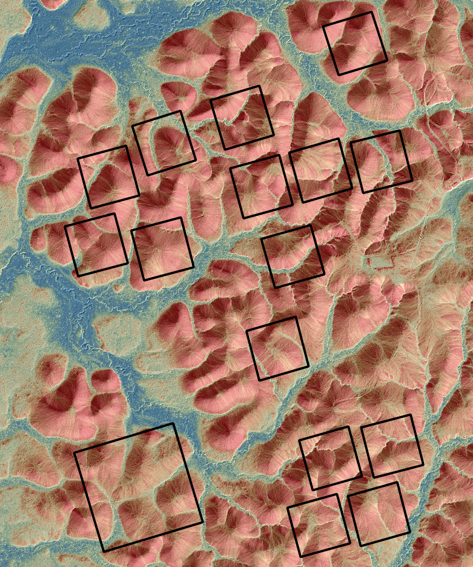
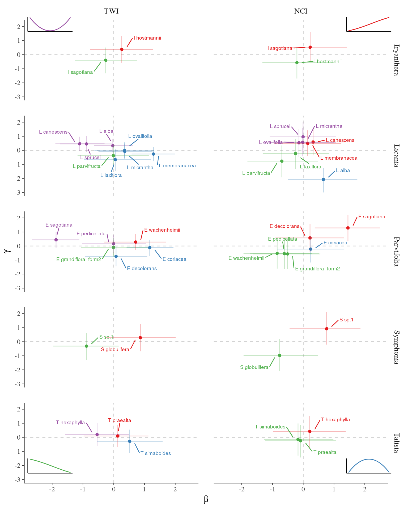
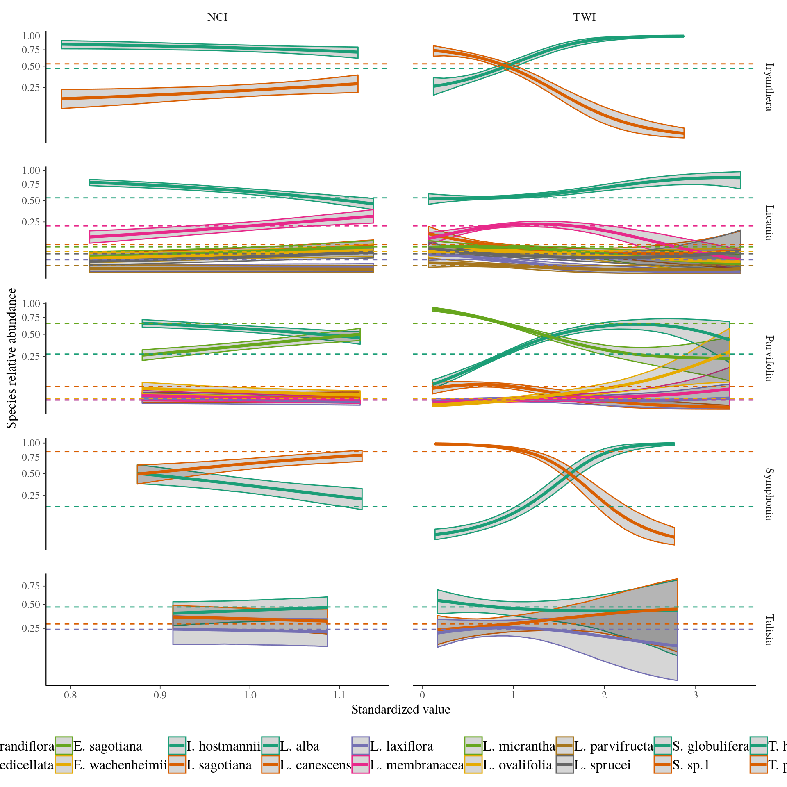

# Introduction

## Setup

```{r setup, message=FALSE, warning=FALSE}
rm(list = ls()) ; gc()
library(knitr)
library(kableExtra)
library(tidyverse)
library(rstan)
library(bayesplot)
theme_set(bayesplot::theme_default())
options(mc.cores = parallel::detectCores())
rstan_options(auto_write = T)
opts_chunk$set(echo = T, eval = T, cache = T, fig.height = 5)
```

# Mathematics

# Single species distribution

## Data

```{r SingleData}
n <- 100
data <- list(
  no = data.frame(Environment = seq(0, 1, length.out = 100),
                  Presence = c(rep(0:1, 50))),
  intermediate = data.frame(Environment = seq(0, 1, length.out = n),
                            Presence = c(rep(0, 20), 
                                         rep(0:1,10),
                                         rep(1,20),
                                         rep(0:1,10),
                                         rep(0,20))),
  limit = data.frame(Environment = seq(0, 1, length.out = n), 
                     Presence = c(rep(0,30), rep(0:1,20), rep(1,30)))
)
mdata <- lapply(data, function(x) list(N = nrow(x),
                                       Presence = x$Presence,
                                       Environment = x$Environment))
```

## Models

```{r SingleModels, render="pandoc", echo=F}
data.frame(
  Name = c("$B_0$", "$B_{\\alpha}$", "$B_{\\alpha, \\alpha_2}$", "$B_{\\alpha, \\beta}$",
           "$B_{\\alpha, \\beta}2$", "$B_{\\alpha, \\beta}3$"),
  Formula = c("$Presence \\sim \\mathcal{B}ernoulli(logit^{-1}(\\alpha_0))$",
              "$Presence \\sim \\mathcal{B}ernoulli(logit^{-1}(\\alpha_0+\\alpha*Environment))$",
              "$Presence \\sim \\mathcal{B}ernoulli(logit^{-1}(\\alpha_0+\\alpha*Environment+\\alpha_2*Environment^2))$",
              "$Presence \\sim \\mathcal{B}ernoulli(logit^{-1}(\\alpha_0+\\alpha*Environment+Environment^{\\beta}))$",
              "$Presence \\sim \\mathcal{B}ernoulli(logit^{-1}(\\alpha_0+\\alpha*(Environment+Environment^{\\beta})))$",
              "$Presence \\sim \\mathcal{B}ernoulli(logit^{-1}(\\alpha_0+Environment^{\\alpha}+Environment^{\\beta}))$")  
) %>% 
  kable(caption = "Models summary.",
        format = "html", escape = F) %>% 
  kable_styling("striped", full_width = F) %>% 
  collapse_rows(1)
```

## Stan code

```{stan SingleStan, output.var="", cache=F, eval=F}
data {
  int<lower=1> N ;                // # of individuals
  int<lower=1> K ;                // # of environmental descriptors
  int<lower=0, upper=1> Y[N] ;    // individuals presence or absence (0-1) 
  matrix[N,K] X ;                 // environmental descriptors
}
parameters {
  real alpha ;       // intercept
  vector[K] beta ;   // sigmoidal slope
  vector[K] gamma ;  // quadratic form
}
model {
  alpha ~ normal(0, 10^6) ; // priors
  beta ~ normal(0, 10^6) ;
  gamma ~ normal(0, 10^6) ;
  Y ~ bernoulli_logit(alpha + X * beta + X .* X * gamma) ;
}
```

## Predictions

```{r SinglePredictions1, fig.cap="Predictions.", echo=T, warning=FALSE, message=FALSE}
load("Wk7_save/SingleModel.Rdata")
g <- lapply(names(fits), function(model){
  lapply(as.list(names(data)), function(type)
    cbind(type = type, data[[type]],
          mu = apply(as.matrix(fits[[model]][[type]], pars = "theta"), 2, mean),
          t(apply(as.matrix(fits[[model]][[type]], pars = "theta"), 2,
                  quantile, probs = c(0.05, 0.95))))) %>%
    bind_rows() %>%
    mutate(model = model)
}) %>% bind_rows() %>%
  ggplot(aes(x = Environment)) +
  geom_point(aes(y = Presence, col = as.factor(Presence))) +
  geom_point(aes(y = mu)) +
  geom_ribbon(aes(ymin = `5%`, ymax = `95%`), color = 'red', alpha = 0.2) +
  geom_line(aes(y = `5%`), col = "red", alpha = 1, size = 0.5, linetype = "dashed") +
  geom_line(aes(y = `95%`), col = "red", alpha = 1, size = 0.5, linetype = "dashed") +
  facet_grid(model ~ type, scales = "free")
```

## Predictions

```{r SinglePredictions2, fig.cap="Predictions.", echo=F}
g
```

# Species joint distribution

## Data

```{r JointData}
n <- 100
data <- list(
  no = data.frame(Environment = seq(0, 1, length.out = 100),
                  A = c(rep(0:1, 50)),
                  B = c(rep(c(1,0), 50)),
                  C = c(rep(c(1,0), 50))),
  intermediate = data.frame(Environment = seq(0, 1, length.out = n),
                            A = c(rep(0, 20), 
                                  rep(0:1,10),
                                  rep(1,20),
                                  rep(0:1,10),
                                  rep(0,20)),
                            B = c(rep(0, 5), 
                                  rep(0:1,10),
                                  rep(1,20),
                                  rep(0:1,10),
                                  rep(0,35)),
                            C = c(rep(0, 35), 
                                  rep(0:1,10),
                                  rep(1,20),
                                  rep(0:1,10),
                                  rep(0,5))),
  limit = data.frame(Environment = seq(0, 1, length.out = n), 
                     A = c(rep(0,30), rep(0:1,20), rep(1,30)),
                     B = c(rep(0, 20), 
                           rep(0:1,10),
                           rep(1,20),
                           rep(0:1,10),
                           rep(0,20)),
                     C = c(rep(1,30), rep(0:1,20), rep(0,30)))
)
data <- lapply(data, function(x) x %>% 
         reshape2::melt(id.vars = "Environment", 
                        variable.name = "Species", value.name = "Presence") %>% 
         filter(Presence != 0) %>% 
         dplyr::select(-Presence))
mdata <- lapply(data, function(x) 
  list(N = nrow(x),
       S = length(unique(x$Species)),
       K = 1,
       X = matrix(x$Environment),
       Y = sapply(levels(as.factor(x$Species)), 
                  function(sp) as.numeric(x$Species == sp))))
```

## Model

> $$Presence \sim \mathcal{Dirichlet~Multinomial}(\\softmax(\alpha + \beta*E + \gamma*E^2))$$

> $$LPMF(y|\alpha) = \Gamma(\sum \alpha)  + \sum(\Gamma(\alpha + y)) \\- \Gamma(\sum \alpha+\sum y) - \sum\Gamma(\alpha)$$

## Stan code - data

$$Presence \sim \mathcal{Dirichlet~Multinomial}(softmax(\alpha + \beta*E + \gamma*E^2))$$

```{stan JointStanData, output.var="", cache=F, eval=F}
data {
  int<lower = 1> N  ;       // # of individuals
  int<lower = 1> S  ;       // # of species
  int<lower = 1> K  ;       // # of environmental descriptors
  int<lower = 0, upper=1> Y[N, S]  ; // individuals presence or absence for each species
  matrix[N,K] X ;           // environmental descriptors
}
```

## Stan code - parameters

$$Presence \sim \mathcal{Dirichlet~Multinomial}(softmax(\alpha + \beta*E + \gamma*E^2))$$

```{stan JointStanParameters, output.var="", cache=F, eval=F}
parameters {
  vector[S] alpha ; // intercept
  matrix[S,K] beta ; // sigmoidal slope
  matrix[S,K] gamma ; // quadratic form
}
```

## Stan code - model

$$Presence \sim \mathcal{Dirichlet~Multinomial}(softmax(\alpha + \beta*E + \gamma*E^2))$$

```{stan JointStanModel, output.var="", cache=F, eval=F}
model {
  alpha ~ normal(0,1) ;  
  for(k in 1:K){
    beta[,k] ~ normal(0,1) ;
    gamma[,k] ~ normal(0,1) ;
  }
  for (n in 1:N)
    Y[n] ~ dirichlet_multinomial(softmax(alpha + 
                                         beta*to_vector(X[n,]) + 
                                         gamma*to_vector(X[n,] .* X[n,])))  ;
}
```

## Stan code - LPMF

$$LPMF(y|\alpha) = \Gamma(\sum \alpha)  + \sum(\Gamma(\alpha + y)) \\- \Gamma(\sum \alpha+\sum y) - \sum\Gamma(\alpha)$$

```{stan JointStanLPMF, output.var="", cache=F, eval=F}
functions {
  real dirichlet_multinomial_lpmf(int[] y, vector alpha) {
    real alpha_plus = sum(alpha);
    return lgamma(alpha_plus) + sum(lgamma(alpha + to_vector(y)))
                - lgamma(alpha_plus+sum(y)) - sum(lgamma(alpha));
  }
}
```

## Stan code - Full

```{stan JointStanFull, output.var="", cache=F, eval=F}
functions {
  real dirichlet_multinomial_lpmf(int[] y, vector alpha) {
    real alpha_plus = sum(alpha);
    return lgamma(alpha_plus) + sum(lgamma(alpha + to_vector(y)))
                - lgamma(alpha_plus+sum(y)) - sum(lgamma(alpha));
  }
}
data {
  int<lower = 1> N  ;       // # of individuals
  int<lower = 1> S  ;       // # of species
  int<lower = 1> K  ;       // # of environmental descriptors
  int<lower = 0, upper=1> Y[N, S]  ; // individuals presence or absence for each species
  matrix[N,K] X ;           // environmental descriptors
}
parameters {
  vector[S] alpha ; // intercept
  matrix[S,K] beta ; // sigmoidal slope
  matrix[S,K] gamma ; // quadratic form
}
model {
  alpha ~ normal(0,1) ;  
  for(k in 1:K){
    beta[,k] ~ normal(0,1) ;
    gamma[,k] ~ normal(0,1) ;
  }
  for (n in 1:N)
    Y[n] ~ dirichlet_multinomial(softmax(alpha + 
                                         beta*to_vector(X[n,]) + 
                                         gamma*to_vector(X[n,] .* X[n,])))  ;
}
```

## Fit

```{r JointFit1, eval=F}
model <- stan_model("Wk7_models/JointModel.stan")
fits <- lapply(mdata, function(x) sampling(model, chains = 2, data = x))
names(fits) <- names(mdata)
save(fits, file = "Wk7_models/Dirichlet.Rdata")
```

```{r JointFit2}
load("Wk7_save/Dirichlet.Rdata")
pars <- c("alpha", "beta", "gamma")
```

## Trace

```{r JointTrace, fig.cap="Trace plot."}
mcmc_trace(fits$intermediate, regex_pars = pars)
```

## Pairs

```{r JointPairs, fig.cap="Pairs plot."}
mcmc_pairs(fits$intermediate, regex_pars = pars)
```

## Predictions

```{r JointPredictions1, fig.cap="Predictions.", echo=T, warning=FALSE, message=FALSE}
g <- lapply(names(mdata), function(type)
  lapply(1:3, function(sp)
    cbind(type = type, data[[type]],
          species = LETTERS[sp],
          Environment = data[[type]]$Environment,
          theta = apply(as.matrix(fits[[type]], 
                                  pars = paste0("theta[", 1:mdata[[type]]$N, ",", sp, "]")), 
                        2, mean),
          theta5 = apply(as.matrix(fits[[type]], 
                                   pars = paste0("theta[", 1:mdata[[type]]$N, ",", sp, "]")), 
                         2, quantile, probs = 0.05),
          theta95 = apply(as.matrix(fits[[type]],
                                    pars = paste0("theta[", 1:mdata[[type]]$N, ",", sp, "]")), 
                          2, quantile, probs = 0.95))) %>% 
  bind_rows()) %>%
  bind_rows() %>% 
  ggplot(aes(x = Environment, col = species)) + 
  geom_ribbon(aes(ymin = theta5, ymax = theta95), alpha = 0.2) +
  geom_line(aes(y = theta)) +
  facet_wrap(~ type, nrow = 3)
```

## Predictions

```{r JointPredictions2, fig.cap="Predictions.", echo=F}
g
```

# Species complexes in Paracou

## Topographic Wetness Index

```{r TWI, fig.cap="Topographic Wetness Index.", echo=F}

```

## Neighbor Crowding Index

$$NCI_i = \sum _{j|\delta_{i,j}<20m} ^{J_i} DBH_j ^2 e^{-\frac{1}{4}\delta_{i,j}}$$

## Posteriors

```{r ParacouPosteriors, fig.cap="Posteriors.", echo=F, fig.height=8}

```

## Predictions

```{r ParacouPredictions, fig.cap="Predictions.", echo=F}

```

