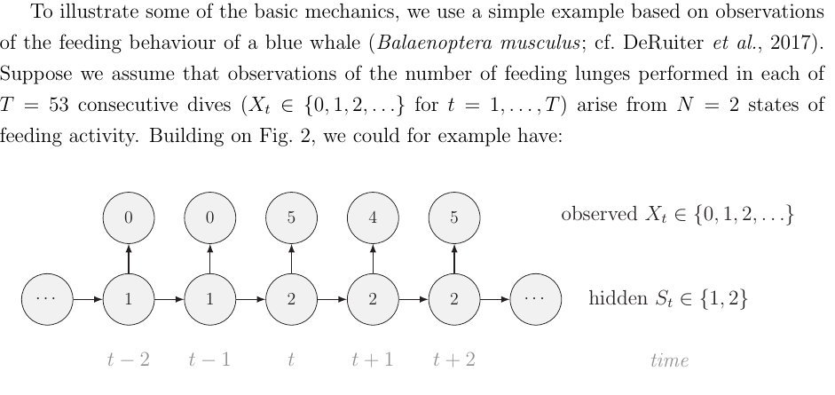
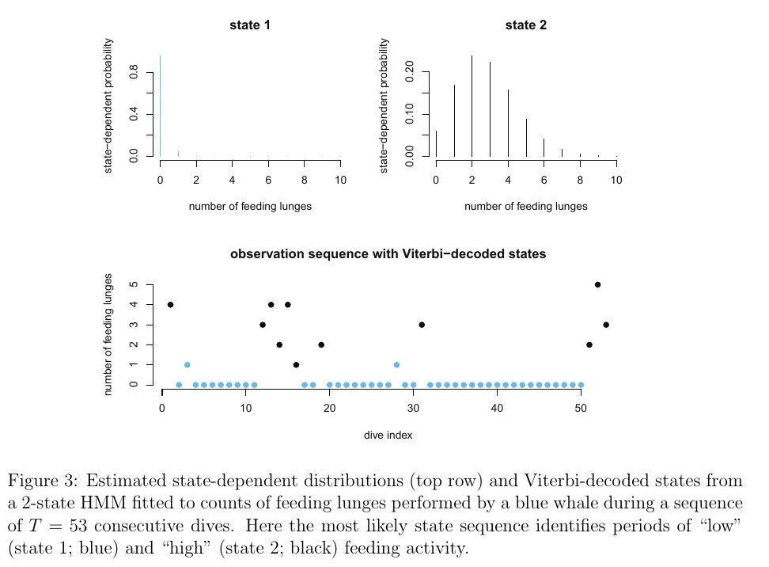
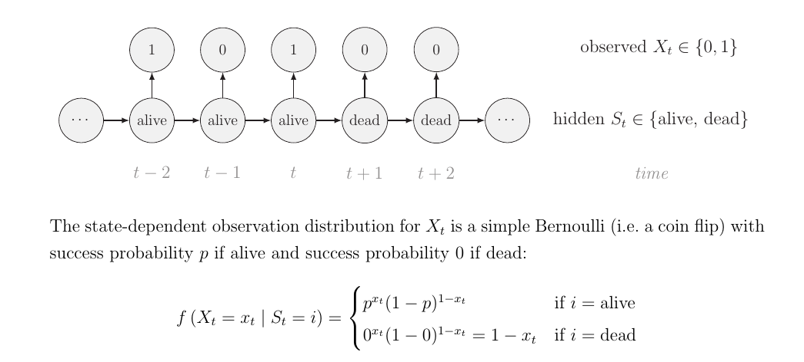
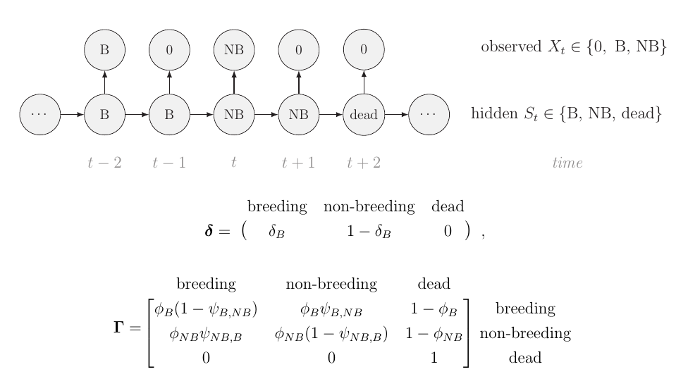
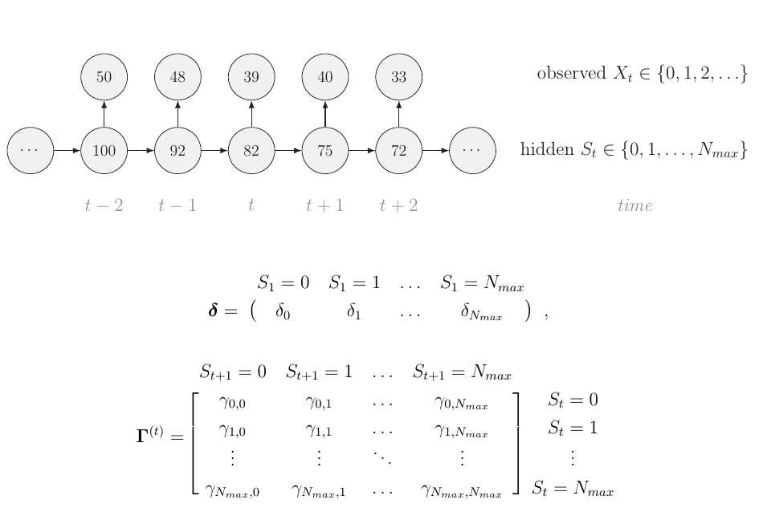

```{r setup, message=FALSE, echo=FALSE, include = FALSE }
rm(list = ls()) ; gc()
library(knitr)
#library(kableExtra)
#library(tidyverse)
library(rstan)
library(bayesplot)
theme_set(bayesplot::theme_default())
options(mc.cores = parallel::detectCores())
rstan_options(auto_write = T)
opts_chunk$set(echo = T, eval = T, cache = T, fig.height = 5)
```

# Introduction

## What is a Hidden Markov Model? 

```{r hmm_def, fig.cap="Basic structure", echo=F}
include_graphics("figs/hmm.png")
```
From @mcclintock2020uncovering's recent review in Ecology Letters (this presentation is more or less a rip-off!). 

## What is it for? 

```{r hmm_uses, fig.cap="All sorts of things - cf. @mcclintock2020uncovering", out.width = "50%", echo=F}
include_graphics("figs/hmm_uses.png")
```

## A very simple Markov chain -- weather prediction

Every day, either it rains or the sun shines. This is the true state $\{1,2\}$ I'm interested in. We assume that weather obeys the **Markov property** so that $\mathbb{P}(S_t|S_{t-1},S_{t-2},S_{t-3},...) = \mathbb{P}(S_t|S_{t-1})$. 

Of course, IRL it doesn't. But let's assume there are four possible transitions for tomorrow's weather 1->1, 1->2, 2->1, 2->2 and these only depend on the weather of the day. 

## What are the model parameters?

These are $\mathbb{P}(\text{ rain at t }|\text{ sun at t-1 }) = 1 - \mathbb{P}(\text{ sun at t }|\text{ sun at t-1 })$ which is formally $\mathbb{P}(S_t = 1 | S_{t-1} = 2)$ // rain = 1, sun = 2. 

We can also estimate $\mathbb{P}(\text{ sun at t }|\text{ rain at t-1 }) = 1- \mathbb{P}(\text{ rain at t }|\text{ rain at t-1 })$ which is formally $\mathbb{P}(S_t = 1 | S_{t-1} = 1)$. 

We assume these do not change over time, so truly there are two transition probabilities: 

Pr(rain -> sun) and Pr(sun -> rain). 

## A little bit of general theory

We stack all this in a matrix of **transition probabilities** $\Gamma = (\gamma_{ij})$ with $\gamma_{ij}=\mathbb{P}(S_t = j |S_{t-1} = i)$^[Many people use $P$ but we stick with $\Gamma$ to match @mcclintock2020uncovering] so that the rows sum to 1. 

In general, let's say I want to compute the probability of the states at time $t$ from those at times $t-1$. 

I then compute $p_{t}[k] = \mathbb{P}(S_t = k) = \sum_i \mathbb{P}(S_t = k |S_{t-1} = i) \mathbb{P}(S_{t-1} = i)$. Thus $p_t =  p_{t-1} \Gamma$. 

## A little bit of theory -- cont'd

So we have the update equation $p_{t} = p_{t-1} P$. It's for an **homogeneous** Markov chain as $P$ does not depend of time (the laws of weather do not change over time -- well, except for seasonality, climate change,...). 

Stationary distribution: $\pi = \pi P$ so that $\pi(I-P) = 0$. The left eigenvectors of P  with an eigenvalue of 1 are the stationary probabilities. 

(true only when a stationary distribution exists, but Markov chains are great in that we know this well)

## The simplest HMM -- adding a binary observation level

My neighbor wakes up very early. When it rains, he usually has an umbrella in the corridor, which I use to make an inference on whether it rains today. 
So $X_t = 1$ when he has an umbrella and $X_t = 0$ when he hasn't. 

## My neighbor, this observation model

We can specify

* $\mathbb{P}(X_t = 1|S_t = 1) = \mathbb{P}(\text{umbrella } | \text{ rain})$ which is also $1 - \mathbb{P}(X_t = 0|S_t = 1)$ 
* $\mathbb{P}(X_t = 1|S_t = 2) = \mathbb{P}(\text{umbrella } | \text{ sun})$

Weather -> Umbrella but Umbrella doesn't affect the weather. New matrix $\mathbf{E} = (E_{ij})$ with $E_{ij} = \mathbb{P}(X_t = j|S_t = i)$ of the so-called **emission probabilities**. 

## The Hidden Markov model

* An observed state $X_t$ that generates observables $x_t$. 
x = (100011110011) 

* A hidden state $S_t$ that generates non-observables $s_t$. 
s =(112221122112) 

* Two matrices of parameters: transition probabilities in $\Gamma$ and emission probabilities in $E$

(actually, $E$ is when you have a categorical emission distribution, more complex emission distribution require something else than a matrix, see @mcclintock2020uncovering). 

# How to fit this model? 

## The problem 

We only observe the sequence of observed states $x=(0,1,0,0,1,0,...)$. You do not know the hidden states, so we have to integrate over these. You could try to evaluate all possibilities, but that's suboptimal: there are $2^T$ sequences of hidden states, and that grows fast with time $T$. 

$\mathcal{L}(\theta|x) = \sum_{\text{paths}} \mathbb{P}(\text{emission} = x|\text{path}) \times \mathbb{P}(\text{path})$

## How to solve it

The likelihood of the last time step given the past is $p_{t-1} \Gamma E_{\bullet,x_T}$ where $E_{\bullet,x_T}$ is a column vector. That's easy. 

The trick is to do a similar thing for all observations, using conditional probability. 

Let denote by the diagonal matrix $O(x_t) = \text{diag}(E_{\bullet,x_t})$. Following @mcclintock2020uncovering (and many others), we will use the forward algorithm. @mcclintock2020uncovering derive the magical formula

$\mathcal{L}(\theta|x) = p_0 \prod_{t=1}^{T} \Gamma O(x_t)$. 

The magic unfolds later. 

## Diverse options for model fitting

* BUGS, JAGS: super easy -> computes posteriors for all the hidden states (updates probabilities for $S_1 = 1, S_1 = 2, S_2 = 1, S_2 = 2,..$ at each iteration of the chain), but very slow. You essentially evaluate the probability of *all possible combinations of states, i.e., all hidden paths*. It's the brute force method. 

Note: BUGS and JAGS uses MCMC (several Markov chains over iterations) to estimates a biological or physical Markov chain (here, the weather). Do not confuse both type of Markov chains. 

## Diverse options for model fitting

* Other idea (math): marginalises the hidden states (wait, what?). 

This is what is used in Stan as Stan *cannot handle sampling from discrete latent states*. By definition almost, a HMM is a model is a discrete latent state model that is Markovian in time. Here we will be using Stan **but really we're just using math**.  We could just as well use optim(). 

## The forward algorithm

Called ``marginalisation'' nowadays (@yackulic2020need) but really an old idea. Instead of using an algorithm that requires $T \times T$ computations, use an algorithm that requires $\sim T$ computations, capitalizing on **recursivity**. 

## The forward algorithm

The **forward probabilities** provide the probability that we end iup in a given state $S_t = s_t$ AND that all the observations $(X_1,...,X_t) = (x_1,...x_t)$ up to time t. Mathematically, $\alpha_t(s) = \mathbb{P}(S_t = s, (X_1,...,X_t) = (x_1,...x_t))$. They're not useful biological stuff. They are just a convenient algorithmic tool.  

## The forward algorithm

Marginalize based on past state 
$\alpha_t(s) = \sum_j \mathbb{P}(S_t = s,S_{t-1} = j,X_{1:t} = x_{1:t})$

Apply Bayes' theorem by conditioning on the past state
$\alpha_t(s) = \sum_j \mathbb{P}(X_{t} = x_{t}|S_t = s,\text{ past stuff })$ 
$\times \mathbb{P}(S_t = s| S_{t-1} = j, \text{ past stuff })$
$\times \mathbb{P}(S_{t-1} = j,X_{1:t-1} = x_{1:t-1})$

## The forward algorithm

$\alpha_t(s) = \sum_j E_{s,x_t} \times \Gamma_{sj} \times \alpha_{t-1}(j)$

Recursive equation that includes the model *transition* and *emission* probabilities. We actually use $\alpha_T$ which is the probability of all observed data (and the past state). 

# Weather example in R and Stan

## Simulating the HMM 

```{r simulating-data}
set.seed(42)
#T=60 #number of days #initial guess
T=1000

### Parameters
Gamma = matrix(c(0.7,0.3,0.2,0.8),2,2,byrow=TRUE) #transition probability matrix
Gamma
E = matrix(c(0.1,0.9,0.75,0.25),2,2,byrow=TRUE) #emission probability matrix
# E matrix         #obs 0  #obs 1, 1 = umbrella
# state 1 = rain   0.1     0.9
# state 2 = sun    0.75    0.25
# (Pr(umbrella|rain) = 90%, Pr(umbrella|sun) = 25%)

```

## Simulating the HMM 

```{r simulating-data-MC}

## simulating the chain

x=s=rep(0,T)
# initial state
x[1] = 1 #umbrella (arbitrarily)
s[1] = 1+rbinom(1,1,0.5)

# temporal process
for (t in 2:T){
  s[t] = 1+rbinom(1,1,Gamma[2,s[t-1]])  #1+ because the state is {1,2}. 
  x[t] = rbinom(1,1,E[s[t],2])  ## we indicate probability of success in a binomial
}
s[1:60]
x[1:60]
## The ones roughly match between x and s, which is logical (more umbrellas when there's more rain!)

```


## Fitting the HMM

```{stan output.var="hmm.weather"}

data {                                             // observations
  int<lower=1> T;                                  // number of observations
  int<lower=0,upper=1> x[T];                       // observed variable
 
}
parameters {                                       // unobserved parameters
  simplex[2] Gamma[2];
  simplex[2] E[2]; 
}
model {
  //useful variables
  real acc[2];
  vector[2] alpha[T]; // T is the first dimension of the array here
  alpha[1,1:2] = rep_vector(0.5,2);

  //priors -- note that rows of the matrices must sum to one. Dirichlet priors. 
   for (n in 1:2){
   Gamma[n] ~ dirichlet(rep_vector(10, 2));
   E[n] ~ dirichlet(rep_vector(10, 2));
   }
  // hoping these will have rows that sum to 1 -- they should. 


  for (t in 2:T){ //loop over time
  
  for (k in 1:2){ //loop over categories for present state k
     for (j in 1:2){//loop over categories for past state j
           acc[j] = alpha[t - 1, j] * Gamma[j,k] * E[k,1+x[t]]; 
      }
      alpha[t,k] = sum(acc);
    }
  }

  target += log(sum(alpha[T])); //should there have been something more? Like, initial probabilities to estimate too? 
}

```

```{r stan-code, eval=F, include=F}
sink("hmm.weather.stan") ### for me, useful to debug
cat("
data {                                             // observations
  int<lower=1> T;                                  // number of observations
  int<lower=0,upper=1> x[T];                       // observed variable
 
}
parameters {                                       // unobserved parameters
  simplex[2] Gamma[2];
  simplex[2] E[2]; 
}
model {
  //useful variables
  real acc[2];
  vector[2] alpha[T]; // T is the first dimension of the array here
  alpha[1,1:2] = rep_vector(0.5,2);

  //priors -- note that rows of the matrices must sum to one. Dirichlet priors. 
   for (n in 1:2){
   Gamma[n] ~ dirichlet(rep_vector(10, 2));
   E[n] ~ dirichlet(rep_vector(10, 2));
   }
  // hoping these will have rows that sum to 1 -- they should. 


  for (t in 2:T){ //loop over time
  
  for (k in 1:2){ //loop over categories for present state k
     for (j in 1:2){//loop over categories for past state j
           acc[j] = alpha[t - 1, j] * Gamma[j,k] * E[k,1+x[t]]; 
      }
      alpha[t,k] = sum(acc);
    }
  }

  target += log(sum(alpha[T])); //should there have been something more? Like, initial probabilities to estimate too? 
}
"
,fill=TRUE)
sink()
```

## Analysing the HMM

```{r fit_model,cache=TRUE}
data = list(x=x, T = T)
## Parameters monitored
params <- c("E", "Gamma")
fit <- sampling(hmm.weather, data = data, iter = 1000, chains = 1, cores = 2)
```

## Analysing the HMM

```{r print_model, cache=TRUE}
print(fit, probs = c(0.10, 0.5, 0.9))
```
NB The algo does not know which is state 2 -- invariance under relabelling issues

## Analysing the HMM

```{r densities-plots}
mcmc_dens(fit, regex_pars = params)
```


```{r stan-execution, eval=F, include=F}
## MCMC settings
ni <- 2000
nt <- 1
nb <- 1000
nc <- 1
### This is my code to execute within R
library(rstan)
fit <- stan("hmm.weather.stan",
                   data = data ,pars = params, 
                   chains = nc, iter = ni, warmup = nb, thin = nt,
                   seed = 1)
print(fit, probs = c(0.10, 0.5, 0.9))
library(bayesplot)
mcmc_dens(fit, regex_pars = params)

```


# Other applications

## Whale behaviour 

```{r hmm_whale, out.width = "80%", echo=F}

```

## Whale behaviour 

```{r hmm_whale2, out.width = "85%", echo=F}
include_graphics("figs/hmm_whale_results.png")
```

## Whale behaviour 

```{r hmm_whale3, out.width = "60%", echo=F}

```

Require "decoding" and backward probabilities -- See @mcclintock2020uncovering. 

## Survival estimation

```{r hmm_cjs, out.width = "85%", echo=F}

```

## Breeding probability estimation

```{r hmm_breeding, out.width = "80%", echo=F}

```

## Population counts

```{r hmm_popcounts, out.width = "75%", echo=F}

```

## And even more applications...

* Movement models (I actually started with this). 

* Ecosystem-state models. 

## Bibliography


